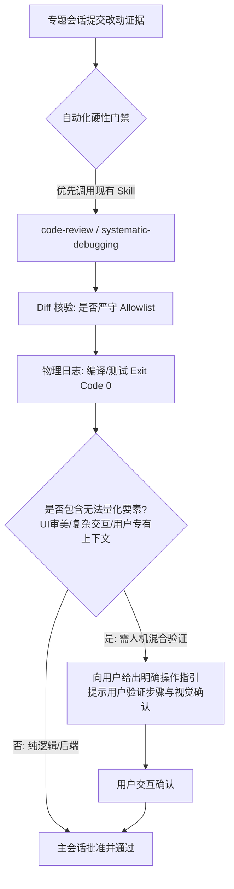

# Universal Task Loop Dispatch & Orchestration Contract


---

## 一、主会话定位与三核心能力（Main Session Role & Capabilities）

### 1. 角色与灵活职责
* **控制面核心**：主会话（Main Session）是任务编排、需求初加工与边界划定的中枢，自身尽量不负责大型业务落地开发。
* **灵活授权**：允许主会话进行**简单直接小改动**（Level 1 场景）以及**全局项目文件扫描读取**以采集关键上下文，并将提炼出的高质量重点信息作为参数注入派单包。
* **专题会话独立性（客观事实）**：各专题会话（Topic Sessions）不仅接受主会话的调度派发，也**完全支持人类用户直接进入会话进行独立交互与开发**，无需强行受到主会话的单向限制。

### 2. 主会话核心编排与裁决能力
1. **需求初加工与定界（Intake & Pruning）**：
   - 识别用户模糊的自然语言，过滤不合理的过度设计，提炼出单一职责的“最小可执行目标（Objective）”。
2. **专题相似度匹配与业务冲突防范（Topic Similarity Matching & Anti-Conflict）**：
   - 在请求专题或发起新专题前，主动比对现有专题库（`sessions.json`、`tags`、`docs/memory/*.md`），复用优先，严禁创建高度重叠的碎片化专题。
3. **任务类型判定与物理修改边界（Task Type: Explore vs Work & Allowlist）**：
   - 明确判定本次任务属于**只读探索 (`explore`)** 还是**修改落地 (`work`)**，精准圈定涉及的文件/目录白名单（Allowlist）。
4. **复杂度裁决与授权策略（1 / 2 / 3 分级）**：
   - 根据代码扩散度、模块跨度和未知风险进行定级授权。

---

## 二、任务类型明确划分：只读 (Explore) vs 修改 (Work) (JSON 规范)

主会话在下发任务包或跨会话发信时，**必须在指令头部与 Payload 中显式声明任务类型 (`task_type`)**：

```json
[
  {
    "task_type": "explore",
    "type_name": "只读探测 / 诊断 / 检索 (Read-Only)",
    "file_write_permission": false,
    "allowlist_nature": "数据源与检索范围 (Source Scope)",
    "execution_constraints": "严禁修改任何业务代码与工程配置；只读读取文件与日志；无需执行文件变更 Diff 质检；产物为结构化调研分析报告或诊断结论。"
  },
  {
    "task_type": "work",
    "type_name": "修改落地 / 编码 / 修复 (Surgical Work)",
    "file_write_permission": true,
    "allowlist_nature": "严格物理修改白名单 (Surgical Write Allowlist)",
    "execution_constraints": "仅允许在 Allowlist 白名单内修改，严禁跨模块泛化修改；必须执行本地单测/编译验证 (Exit Code 0)；改动必须经过 Diff 质检与记忆回写。"
  }
]
```

#### 派单消息头部标准化模板：
* **只读任务**：`[主会话派单任务: EXPLORE (只读)] 会话专题负责人...`
* **修改任务**：`[主会话派单任务: WORK (修改)] 会话专题负责人...`

---

## 三、复杂度裁决与派发规则（1 / 2 / 3 做减法 JSON 规范）

```json
[
  {
    "complexity": 1,
    "tier_name": "Level 1 (Simple)",
    "scenario": "单点 Bugfix、单文件/文本/配置微调、只读排查、快速查询",
    "subagent_policy": "none",
    "execution_rule": "极速直发：直接派发到专题会话（或主会话直接快速微调），单线程立即执行，无需复杂 Q&A，极速闭环。"
  },
  {
    "complexity": 2,
    "tier_name": "Level 2 (Standard)",
    "scenario": "模块内常规特性开发、多文件协作改动、标准重构",
    "subagent_policy": "optional",
    "execution_rule": "标准派发：专题在边界（Allowlist）内执行标准开发、单元测试与所属记忆回写。"
  },
  {
    "complexity": 3,
    "tier_name": "Level 3 (Complex)",
    "scenario": "跨模块架构变动、大型新功能开发、深度疑难排障（>3 分钟）",
    "subagent_policy": "mandatory",
    "execution_rule": "强制 Subagent 编排：专题会话作为二级主管，必须调用 invoke_subagent 拆分 Research / Worker / Reviewer 子代理并行推进后集成汇报。"
  }
]
```

---

## 三、质检与人机混合验证模型（Hybrid Verification）



1. **优先复用环境既有代码审查 Skill**：
   - 质检时优先检测环境中已安装的审查技能（如 `code-review`、`superpowers:code-review`、`receiving-code-review`、`systematic-debugging`），以专业评审标准进行走查。
2. **人机混合验证（Human-in-the-Loop）**：
   - **客观现实**：图形渲染、UI 审美、跨端交互效果以及超出 AI 上下文的业务体验无法完全由脚本自动化衡量。
   - **规则**：当遇到不可量化或不确定的视觉/业务点时，主会话严禁伪造“完全验证”，必须转为**人机混合验证**——由 AI 负责构建与日志核验，同时向用户输出详尽的**【用户验证指引卡】**（告知用户如何点击、查看何种预期效果），由用户做最终验收。

---

## 四、走弯路识别与合法 SDK 干预机制

### 1. 走弯路（Wandering）特征指标
主会话在监控或收到中间汇报时，通过以下特征研判专题是否偏离正轨：
* **时间/轮次畸高**：简单任务交互超过预估阈值（如 Level 1 超过 3 轮未收敛）；
* **范围扩散**：改动扩散到了 Allowlist 之外的文件；
* **错误震荡**：同一报错在 2 次以上尝试中反复出现且未见收敛趋势。

### 2. 合法 SDK 干预动作
* **严禁非法工具调用**，必须使用官方原生 SDK 工具进行干预：
  * **纠偏指令**：使用 `send_message` 向目标会话发送结构化【纠偏通知】，勒令回滚越界改动并给出收敛路径；
  * **超时熔断**：在 AGY 环境下使用 `manage_subagents(Action='kill')` 终止失控的子代理树，避免 Token 浪费。

---

## 五、专题会话与执行端标准执行流 (Topic Session & Worker Workflow Parity)

无论主会话处于**默认自然语言直接交互模式**还是**可选文件状态机模式**，专题会话及其内部子代理（Topic Session & Subagents）的执行生命周期 100% 保持前后一致：

```json
[
  {
    "stage": "1. 承接与边界锁定 (Intake & Boundary)",
    "action": "解析任务 Objective、Allowlist 白名单、验收准则与 1/2/3 复杂度。"
  },
  {
    "stage": "2. 边界实施 (Surgical Execution)",
    "action": "仅在 Allowlist 白名单内修改，杜绝跨模块蔓延；项目内持久化 md 禁用表格（强制 JSON 代码块），统一 UTF-8 编码，强制使用原生编辑工具。"
  },
  {
    "stage": "3. 本地自测 (Self-Verification)",
    "action": "运行全量单元测试与编译构建（Exit Code 0）；Diff 走查核对无越界改动。"
  },
  {
    "stage": "4. 记忆回写 (Topic Memory Put)",
    "action": "若产生经过证实的新事实/架构决策，回写所属专题文档 docs/memory/*.md。"
  },
  {
    "stage": "5. 强制反向交付 (Mandatory Deliverable via Sidebus)",
    "action": "自测通过后严禁仅在当前视窗输出文本停下，必须且强制在最后一轮调用 send_message(recipient=\"<main_thread_id>\", message=\"[专题交付: WORK]...\") 向上级汇报：Summary (核心摘要)、Changes (修改清单)、Evidence (测试证据) 与人机混合验证操作卡，触发主中枢验收。"
  }
]
```

---

## 六、动态白名单申请审批与跨专题冲突控制协议 (Allowlist Expansion & Conflict Control)

当专题会话在实施过程中发现需要修改未包含在初始派单白名单中的文件时，必须严格遵守以下动态审批与跨专题冲突控制闭环：

### 1. 交互时序与报文定义 (Message Schemas JSON)

```json
[
  {
    "stage": "1. 专题发起申请 (ALLOWLIST_EXPANSION_REQUEST)",
    "sender": "Topic Session",
    "recipient": "Main Session (main_thread_id)",
    "payload_example": {
      "type": "ALLOWLIST_EXPANSION_REQUEST",
      "topic_session_id": "cdd1ca5c-3532-4489-b844-15c6f34055fa",
      "target_files": [
        "scripts/hooks/enforce_allowlist.js",
        "scripts/hooks/enforce_allowlist.py"
      ],
      "reason": "排查发现需要对拦截器输出的驳回提示增加标准化 JSON Payload 指引，需扩展白名单进行协同修改。"
    }
  },
  {
    "stage": "2. 主中枢冲突校验与批准 (ALLOWLIST_EXPANSION_APPROVED)",
    "sender": "Main Session",
    "recipient": "Topic Session",
    "condition": "主会话比对当前所有 active 任务 (todo.json / lease.json)，确认无其他专题并发占用该文件",
    "payload_example": {
      "type": "ALLOWLIST_EXPANSION_APPROVED",
      "approved_files": [
        "scripts/hooks/enforce_allowlist.js",
        "scripts/hooks/enforce_allowlist.py"
      ],
      "updated_allowlist": [
        "scripts/hooks/enforce_allowlist.js",
        "scripts/hooks/enforce_allowlist.py",
        "tests/test_hooks_pipeline.test.js"
      ],
      "instruction": "白名单已在 todo.json 中同步更新，请在扩展范围内精准实施并自测。"
    }
  },
  {
    "stage": "3. 主中枢冲突阻断与串行化 (ALLOWLIST_EXPANSION_REJECTED)",
    "sender": "Main Session",
    "recipient": "Topic Session",
    "condition": "主会话检测到其他并发专题正在修改目标文件或存在高危逻辑冲突",
    "payload_example": {
      "type": "ALLOWLIST_EXPANSION_REJECTED",
      "conflicted_files": [
        "scripts/hooks/enforce_allowlist.js"
      ],
      "conflicted_with_session": "1057c10a-523d-47a4-858e-eabeaa784932",
      "resolution": "目标文件正在由 hook 专题会话并行重构，当前申请已被阻断。请先完成现有白名单内工作，待该会话交付后再行串行调度。"
    }
  }
]
```

### 2. 主会话跨专题冲突控制三铁律 (Main Session Conflict Control Laws)
1. **排他修改权原则**: 任何物理代码文件在同一时间段内仅允许被一个处于 `in_progress` 的专题会话写入；
2. **状态机同步原子性**: 主会话批准扩展申请后，必须在下发 `ALLOWLIST_EXPANSION_APPROVED` 之前完成 `.agents/task-loop/todo.json` 中该任务 `allowlist` 字段的持久化追加；
3. **高危冲突降级串行**: 发现两个专题修改范围交叠时，主中枢必须强行将后一个任务转为 `pending` 挂起，严禁并发合并。

---

## 七、主会话批判性门禁验收标准四步法与驳回协议 (Critical Verification Gate & Rejection Protocol)

主会话收到专题会话发起的交付汇报（`send_message`）后，**严禁充当传声筒盲目轻信、透传或直接更新 todo.json 状态**。主会话必须严格执行以下四步独立质检闭环：

### 1. 门禁验收标准四步法 (4-Step Gate Checklist)

```json
[
  {
    "step": "Step 1. 独立执行验证命令 (Independent Execution)",
    "description": "主会话必须在自身终端亲自/独立运行全量自动化单测或编译构建命令，亲眼确认 Exit Code 0 与真实输出日志，严禁仅听信专题文字总结。"
  },
  {
    "step": "Step 2. 真实 Diff 审查 (Diff & Allowlist Inspection)",
    "description": "严格走查本地 Git Diff 与工作区修改文件，确认 100% 严格落在派单 Allowlist 范围内，无多余文件、无编码/格式污染、无意外死代码。"
  },
  {
    "step": "Step 3. 必要时派遣 Reviewer 审查 (Proactive Reviewer Subagent)",
    "description": "针对 Level 2/3、核心底层改动或高风险逻辑，主会话可按需拉起 reviewer 子代理进行代码走查与架构交叉核验。"
  },
  {
    "step": "Step 4. 门禁裁决与闭环处理 (Gate Verdict & Closeout)",
    "description": "四步核验全绿方可更新 todo.json 为 completed 并向用户交付；发现任何单测失败、越界修改或逻辑缺陷，强制下发 DELIVERABLE_REJECTED 驳回重修。"
  }
]
```

### 2. 交付驳回与重修报文协议 (DELIVERABLE_REJECTED Schema JSON)

```json
[
  {
    "stage": "主中枢门禁驳回 (DELIVERABLE_REJECTED)",
    "sender": "Main Session",
    "recipient": "Topic Session",
    "condition": "主会话独立质检时发现单测失败、越界修改、编译报错或审查未通过",
    "payload_example": {
      "type": "DELIVERABLE_REJECTED",
      "task_id": "task_20260902_001",
      "failed_gates": [
        "Gate 1 (独立测试失败): node tests/test_hooks_pipeline.test.js 抛出 ReferenceError",
        "Gate 2 (Diff 越界): 检测到修改了未授权文件 src/extra_util.js"
      ],
      "rejection_reason": "主会话独立执行单测未通过，且检测到非白名单文件修改。",
      "action_required": "请立即回滚未授权文件修改，修复单测异常并重新自测后再次交付。"
    }
  }
]
```

---

## 八、派单双阶梯看门狗监督机制 (Dual-Stage Watchdog Supervision)

为消除专题会话由于后台休眠未触发、陷入死循环或理解偏离目标导致的派单失控，主会话派单后必须挂载并执行【30s + 120s 双阶梯看门狗监督闭环】：

### 1. 双阶梯监督时序与动作定义 (Watchdog Lifecycle JSON)

```json
[
  {
    "stage": "Stage 1: 30s 激活探针 (Activation Probe)",
    "timing": "派单后挂载 schedule(DurationSeconds=30, Prompt=\"检查专题会话激活状态\", TimerCondition=\"any\")",
    "trigger_condition": "派单发信 30 秒后触发",
    "inspection_actions": "执行 node scripts/inspect_agy_sessions.js 或读取 sessions.json / 日志，检查目标专题步数是否增长、是否进入 ACTIVE 状态。",
    "abnormal_resolution": "若状态仍为 IDLE_SLEEPING 或步数未增加，主会话主动干预，并在界面向用户呈现 [-> 点击切换并激活专题会话](conversation://<session_id>) Deep Link，消除休眠断点。"
  },
  {
    "stage": "Stage 2: 120s 偏差巡检与干预 (Alignment Audit)",
    "timing": "派单后挂载 schedule(DurationSeconds=120, Prompt=\"巡检专题会话执行偏差\", TimerCondition=\"any\")",
    "trigger_condition": "派单发信 120 秒后触发",
    "inspection_actions": "读取目标专题 transcript.jsonl 最新 steps，走查：1. 是否偏离单一职责目标；2. 是否发生无限死循环/重复调用；3. 推演逻辑是否存在严重技术漏洞；4. 是否尝试越界修改。",
    "abnormal_resolution": "若发现执行偏差，主会话立即调用 send_message(recipient=\"<topic_session_id>\", message=\"【主中枢偏差修正指令】检测到执行路径偏离目标...请按以下修正方案调整...\") 进行强力干预。"
  }
]
```

### 2. 监督定时器调用与清理规范 (Schedule Rules)
1. **统一标准工具**: 必须使用系统原生 `schedule` 工具设定倒计时（严禁使用后台 `sleep` 命令）；
2. **提前交付短路**: 若专题会话在 30s 或 120s 内提前完成交付并发送 `send_message`，主中枢收到回执后自动唤醒并可直接回收/忽略该监督定时器；
3. **巡检无干预放行**: 若 120s 巡检确认专题思路清晰且正在执行正常长耗时单测/构建，主会话不发送扰动指令，允许其平稳运行直至交付。

---

## 九、透明思考与决策推演卡模板（Decision Matrix）

主会话在每次执行需求分析、派发裁决或质检时，**必须在 Thinking 及最终回复中输出决策推演卡**：

```markdown
### [Decision Card] 主会话决策推演卡
- **用户需求初加工**：[提炼后的核心目标与范围]
- **复杂度定级与理由**：Level [1/2/3]（原因：涉及模块数 X，代码改动预估 Y 行）
- **修改物理边界 (Allowlist)**：[`path/to/file1`, `path/to/file2`]
- **路由目标会话**：[Target Session ID / Module Key]
- **跨专题冲突校验**：[无冲突 / 已隔离锁定目标文件]
- **看门狗监督机制**：[已挂载 30s 激活探针 + 120s 偏差巡检定时器]
- **批判性门禁独立质检证据**：[单测 Exit Code 0 / Diff 白名单审查结果 / Reviewer 审查结果]
- **验证与质检策略**：[自动化测试命令 + 人机混合验证步骤]
```

---

## 十、未来演进预留（TODO）

* **TODO：调用链路追溯与项目级轻量持久化（Traceability Journal）**：
  - *规划方向*：未来可在 `.agents/task-loop/trace-journal.jsonl` 中记录 Main 到各 Topic 会话的调用链、派发快照与干预历史，便于排查复杂长周期任务的链路决策。
  - *当前策略*：出于轻量化与运行性能考量，当前版本仅维护核心 `run-journal.jsonl`，待后续按需平滑拓展。
