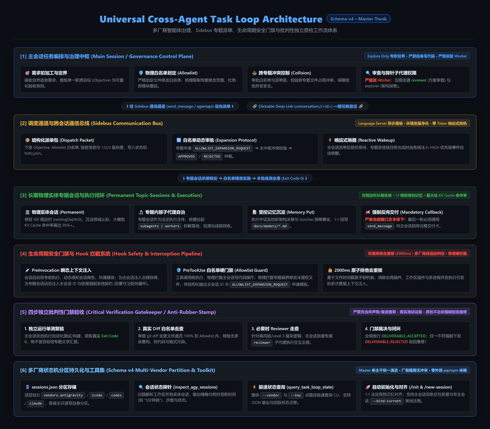
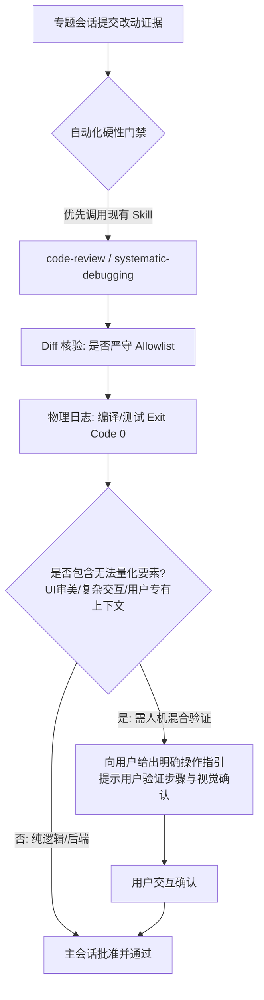

# Universal Task Loop Dispatch & Orchestration Contract



---

## 一、主会话定位与三核心能力（Main Session Role & Capabilities）

### 1. 角色与灵活职责
* **控制面核心**：主会话（Main Session）是任务编排、需求初加工与边界划定的中枢，自身尽量不负责大型业务落地开发。
* **灵活授权**：允许主会话进行**简单直接小改动**（Level 1 场景）以及**全局项目文件扫描读取**以采集关键上下文，并将提炼出的高质量重点信息作为参数注入派单包。
* **专题会话独立性（客观事实）**：各专题会话（Topic Sessions）不仅接受主会话的调度派发，也**完全支持人类用户直接进入会话进行独立交互与开发**，无需强行受到主会话的单向限制。

### 2. 主会话核心编排与裁决能力
1. **需求初加工与定界（Intake & Pruning）**：
   - 识别用户模糊的自然语言，过滤不合理的过度设计，提炼出单一职责的“最小可执行目标（Objective）”。
2. **专题相似度匹配与业务冲突防范（Topic Similarity Matching & Anti-Conflict）**：
   - 在请求专题或发起新专题前，主动比对现有专题库（`sessions.json`、`tags`、`docs/memory/*.md`），复用优先，严禁创建高度重叠的碎片化专题。
3. **任务类型判定与物理修改边界（Task Type: Explore vs Work & Allowlist）**：
   - 明确判定本次任务属于**只读探索 (`explore`)** 还是**修改落地 (`work`)**，精准圈定涉及的文件/目录白名单（Allowlist）。
4. **复杂度裁决与授权策略（1 / 2 / 3 分级）**：
   - 根据代码扩散度、模块跨度和未知风险进行定级授权。

---

## 二、任务类型明确划分：只读 (Explore) vs 修改 (Work) (JSON 规范)

主会话在下发任务包或跨会话发信时，**必须在指令头部与 Payload 中显式声明任务类型 (`task_type`)**：

```json
[
  {
    "task_type": "explore",
    "type_name": "只读探测 / 诊断 / 检索 (Read-Only)",
    "file_write_permission": false,
    "allowlist_nature": "数据源与检索范围 (Source Scope)",
    "execution_constraints": "严禁修改任何业务代码与工程配置；只读读取文件与日志；无需执行文件变更 Diff 质检；产物为结构化调研分析报告或诊断结论。"
  },
  {
    "task_type": "work",
    "type_name": "修改落地 / 编码 / 修复 (Surgical Work)",
    "file_write_permission": true,
    "allowlist_nature": "严格物理修改白名单 (Surgical Write Allowlist)",
    "execution_constraints": "仅允许在 Allowlist 白名单内修改，严禁跨模块泛化修改；必须执行本地单测/编译验证 (Exit Code 0)；改动必须经过 Diff 质检与记忆回写。"
  }
]
```

#### 派单消息头部标准化模板：
* **只读任务**：`[主会话派单任务: EXPLORE (只读)] 会话专题负责人...`
* **修改任务**：`[主会话派单任务: WORK (修改)] 会话专题负责人...`

---

## 三、复杂度裁决与派发规则（1 / 2 / 3 做减法 JSON 规范）

```json
[
  {
    "complexity": 1,
    "tier_name": "Level 1 (Simple)",
    "scenario": "单点 Bugfix、单文件/文本/配置微调、只读排查、快速查询",
    "subagent_policy": "none",
    "execution_rule": "极速直发：直接派发到专题会话（或主会话直接快速微调），单线程立即执行，无需复杂 Q&A，极速闭环。"
  },
  {
    "complexity": 2,
    "tier_name": "Level 2 (Standard)",
    "scenario": "模块内常规特性开发、多文件协作改动、标准重构",
    "subagent_policy": "optional",
    "execution_rule": "标准派发：专题在边界（Allowlist）内执行标准开发、单元测试与所属记忆回写。"
  },
  {
    "complexity": 3,
    "tier_name": "Level 3 (Complex)",
    "scenario": "跨模块架构变动、大型新功能开发、深度疑难排障（>3 分钟）",
    "subagent_policy": "mandatory",
    "execution_rule": "强制 Subagent 编排：专题会话作为二级主管，必须调用 invoke_subagent 拆分 Research / Worker / Reviewer 子代理并行推进后集成汇报。"
  }
]
```

---

## 三、质检与人机混合验证模型（Hybrid Verification）



1. **优先复用环境既有代码审查 Skill**：
   - 质检时优先检测环境中已安装的审查技能（如 `code-review`、`superpowers:code-review`、`receiving-code-review`、`systematic-debugging`），以专业评审标准进行走查。
2. **人机混合验证（Human-in-the-Loop）**：
   - **客观现实**：图形渲染、UI 审美、跨端交互效果以及超出 AI 上下文的业务体验无法完全由脚本自动化衡量。
   - **规则**：当遇到不可量化或不确定的视觉/业务点时，主会话严禁伪造“完全验证”，必须转为**人机混合验证**——由 AI 负责构建与日志核验，同时向用户输出详尽的**【用户验证指引卡】**（告知用户如何点击、查看何种预期效果），由用户做最终验收。

---

## 四、走弯路识别与合法 SDK 干预机制

### 1. 走弯路（Wandering）特征指标
主会话在监控或收到中间汇报时，通过以下特征研判专题是否偏离正轨：
* **时间/轮次畸高**：简单任务交互超过预估阈值（如 Level 1 超过 3 轮未收敛）；
* **范围扩散**：改动扩散到了 Allowlist 之外的文件；
* **错误震荡**：同一报错在 2 次以上尝试中反复出现且未见收敛趋势。

### 2. 合法 SDK 干预动作
* **严禁非法工具调用**，必须使用官方原生 SDK 工具进行干预：
  * **纠偏指令**：使用 `send_message` 向目标会话发送结构化【纠偏通知】，勒令回滚越界改动并给出收敛路径；
  * **超时熔断**：在 AGY 环境下使用 `manage_subagents(Action='kill')` 终止失控的子代理树，避免 Token 浪费。

---

## 五、子会话前后一致的标准执行流 (Sub-Session Workflow Parity)

无论主会话处于**默认自然语言直接交互模式**还是**可选文件状态机模式**，子会话（Subagent / Topic Session）的执行生命周期 100% 保持前后一致：

```json
[
  {
    "stage": "1. 承接与边界锁定 (Intake & Boundary)",
    "action": "解析任务 Objective、Allowlist 白名单、验收准则与 1/2/3 复杂度。"
  },
  {
    "stage": "2. 边界实施 (Surgical Execution)",
    "action": "仅在 Allowlist 白名单内修改，杜绝跨模块蔓延；项目内持久化 md 禁用表格（强制 JSON 代码块），统一 UTF-8 编码，强制使用原生编辑工具。"
  },
  {
    "stage": "3. 本地自测 (Self-Verification)",
    "action": "运行全量单元测试与编译构建（Exit Code 0）；Diff 走查核对无越界改动。"
  },
  {
    "stage": "4. 记忆回写 (Topic Memory Put)",
    "action": "若产生经过证实的新事实/架构决策，回写所属专题文档 docs/memory/*.md。"
  },
  {
    "stage": "5. 标准交付 (Deliverable)",
    "action": "向上级汇报：Summary (核心摘要)、Changes (修改清单)、Evidence (测试证据) 与人机混合验证操作卡。"
  }
]
```

---

## 六、透明思考与决策推演卡模板（Decision Matrix）

主会话在每次执行需求分析、派发裁决或质检时，**必须在 Thinking 及最终回复中输出决策推演卡**：

```markdown
### [Decision Card] 主会话决策推演卡
- **用户需求初加工**：[提炼后的核心目标与范围]
- **复杂度定级与理由**：Level [1/2/3]（原因：涉及模块数 X，代码改动预估 Y 行）
- **修改物理边界 (Allowlist)**：[`path/to/file1`, `path/to/file2`]
- **路由目标会话**：[Target Session ID / Module Key]
- **验证与质检策略**：[自动化测试命令 + 人机混合验证步骤]
```

---

## 六、未来演进预留（TODO）

* **TODO：调用链路追溯与项目级轻量持久化（Traceability Journal）**：
  - *规划方向*：未来可在 `.agents/task-loop/trace-journal.jsonl` 中记录 Main 到各 Topic 会话的调用链、派发快照与干预历史，便于排查复杂长周期任务的链路决策。
  - *当前策略*：出于轻量化与运行性能考量，当前版本仅维护核心 `run-journal.jsonl`，待后续按需平滑拓展。
