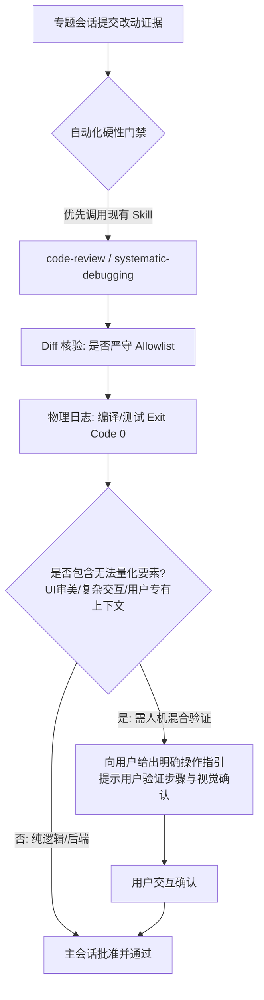

# Universal Task Loop Dispatch & Orchestration Contract


---

## 一、主会话定位与三核心能力（Main Session Role & Capabilities）

### 1. 角色与灵活职责
* **控制面核心**：主会话（Main Session）是任务编排、需求初加工与边界划定的中枢，自身尽量不负责大型业务落地开发。
* **灵活授权**：允许主会话进行**简单直接小改动**（Level 1 场景）以及**全局项目文件扫描读取**以采集关键上下文，并将提炼出的高质量重点信息作为参数注入派单包。
* **专题会话独立性（客观事实）**：各专题会话（Topic Sessions）不仅接受主会话的调度派发，也**完全支持人类用户直接进入会话进行独立交互与开发**，无需强行受到主会话的单向限制。

### 2. 主会话三大核心能力
1. **需求初加工与定界（Intake & Pruning）**：
   - 识别用户模糊的自然语言，过滤不合理的过度设计，提炼出单一职责的“最小可执行目标（Objective）”。
2. **物理修改边界划定（Surgical Allowlist）**：
   - 精准圈定本次改动所允许涉及的文件/目录白名单（Allowlist），严禁专题会话越界修改无关业务代码。
3. **复杂度裁决与授权策略（1 / 2 / 3 分级）**：
   - 根据代码扩散度、模块跨度和未知风险进行定级授权。

---

## 二、复杂度裁决与派发规则（1 / 2 / 3 做减法）

| 复杂度等级 (`complexity`) | 适用场景 | 注入策略 (`subagent_policy`) | 派发与执行规则 |
|---|---|---|---|
| **Level 1（简单）** | 单点 Bugfix、单文件/文本/配置微调、只读排查、快速查询 | `none` | **极速直发**：直接派发到专题会话（或主会话直接快速微调），单线程立即执行，无需复杂 Q&A，极速闭环。 |
| **Level 2（标准）** | 模块内常规特性开发、多文件协作改动、标准重构 | `optional` | **标准派发**：专题在边界（Allowlist）内执行标准开发、单元测试与所属记忆回写。 |
| **Level 3（复杂）** | 跨模块架构变动、大型新功能开发、深度疑难排障（>3 分钟） | `mandatory` | **强制 Subagent 编排**：专题会话作为二级主管，**必须**调用 `invoke_subagent` 拆分 Research / Worker / Reviewer 子代理并行推进后集成汇报。 |

---

## 三、质检与人机混合验证模型（Hybrid Verification）



1. **优先复用环境既有代码审查 Skill**：
   - 质检时优先检测环境中已安装的审查技能（如 `code-review`、`superpowers:code-review`、`receiving-code-review`、`systematic-debugging`），以专业评审标准进行走查。
2. **人机混合验证（Human-in-the-Loop）**：
   - **客观现实**：图形渲染、UI 审美、跨端交互效果以及超出 AI 上下文的业务体验无法完全由脚本自动化衡量。
   - **规则**：当遇到不可量化或不确定的视觉/业务点时，主会话严禁伪造“完全验证”，必须转为**人机混合验证**——由 AI 负责构建与日志核验，同时向用户输出详尽的**【用户验证指引卡】**（告知用户如何点击、查看何种预期效果），由用户做最终验收。

---

## 四、走弯路识别与合法 SDK 干预机制

### 1. 走弯路（Wandering）特征指标
主会话在监控或收到中间汇报时，通过以下特征研判专题是否偏离正轨：
* **时间/轮次畸高**：简单任务交互超过预估阈值（如 Level 1 超过 3 轮未收敛）；
* **范围扩散**：改动扩散到了 Allowlist 之外的文件；
* **错误震荡**：同一报错在 2 次以上尝试中反复出现且未见收敛趋势。

### 2. 合法 SDK 干预动作
* **严禁非法工具调用**，必须使用官方原生 SDK 工具进行干预：
  * **纠偏指令**：使用 `send_message` 向目标会话发送结构化【纠偏通知】，勒令回滚越界改动并给出收敛路径；
  * **超时熔断**：在 AGY 环境下使用 `manage_subagents(Action='kill')` 终止失控的子代理树，避免 Token 浪费。

---

## 五、透明思考与决策推演卡模板（Decision Matrix）

主会话在每次执行需求分析、派发裁决或质检时，**必须在 Thinking 及最终回复中输出决策推演卡**：

```markdown
### [Decision Card] 主会话决策推演卡
- **用户需求初加工**：[提炼后的核心目标与范围]
- **复杂度定级与理由**：Level [1/2/3]（原因：涉及模块数 X，代码改动预估 Y 行）
- **修改物理边界 (Allowlist)**：[`path/to/file1`, `path/to/file2`]
- **路由目标会话**：[Target Session ID / Module Key]
- **验证与质检策略**：[自动化测试命令 + 人机混合验证步骤]
```

---

## 六、未来演进预留（TODO）

* **TODO：调用链路追溯与项目级轻量持久化（Traceability Journal）**：
  - *规划方向*：未来可在 `.agents/task-loop/trace-journal.jsonl` 中记录 Main 到各 Topic 会话的调用链、派发快照与干预历史，便于排查复杂长周期任务的链路决策。
  - *当前策略*：出于轻量化与运行性能考量，当前版本仅维护核心 `run-journal.jsonl`，待后续按需平滑拓展。
