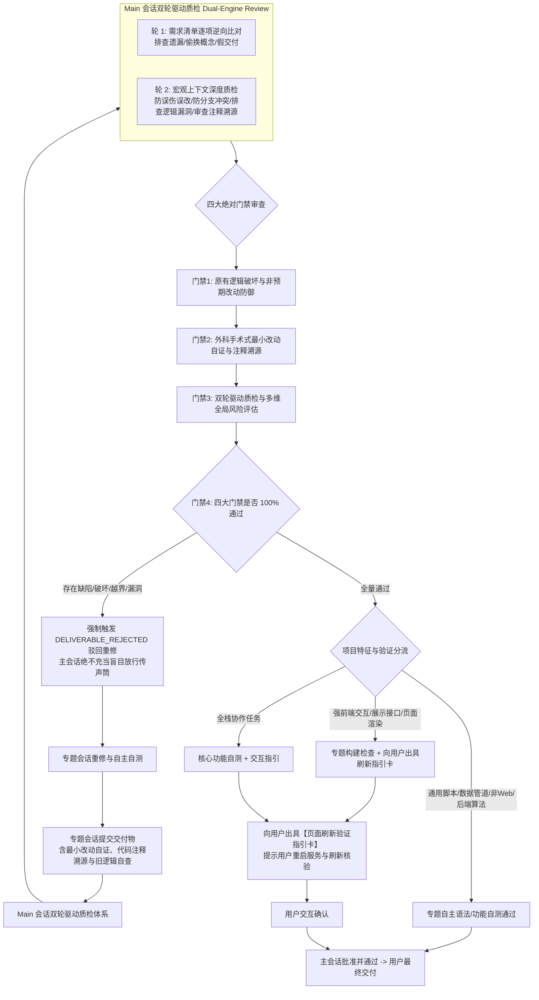

# Universal Task Loop Dispatch & Orchestration Contract


---

## 一、主会话定位与三核心能力（Main Session Role & Capabilities）

### 1. 角色与灵活职责
* **控制面核心**：主会话（Main Session）是任务编排、需求初加工与边界划定的中枢，自身尽量不负责大型业务落地开发。
* **灵活授权**：允许主会话进行**简单直接小改动**（Level 1 场景）以及**全局项目文件扫描读取**以采集关键上下文，并将提炼出的高质量重点信息作为参数注入派单包。
* **专题会话独立性（客观事实）**：各专题会话（Topic Sessions）不仅接受主会话的调度派发，也**完全支持人类用户直接进入会话进行独立交互与开发**，无需强行受到主会话的单向限制。

### 2. 主会话核心编排与裁决能力
1. **需求初加工与定界（Intake & Pruning）**：
   - 识别用户模糊的自然语言，过滤不合理的过度设计，提炼出单一职责的“最小可执行目标（Objective）”。
2. **专题相似度匹配与业务冲突防范（Topic Similarity Matching & Anti-Conflict）**：
   - 在请求专题或发起新专题前，主动比对现有专题库（`sessions.json`、`tags`、`docs/memory/*.md`），复用优先，严禁创建高度重叠的碎片化专题。
3. **任务类型判定与物理修改边界（Task Type: Explore vs Work & Allowlist）**：
   - 明确判定本次任务属于**只读探索 (`explore`)** 还是**修改落地 (`work`)**，精准圈定涉及的文件/目录白名单（Allowlist）。
4. **复杂度裁决与授权策略（1 / 2 / 3 分级）**：
   - 根据代码扩散度、模块跨度和未知风险进行定级授权。

---

## 二、任务类型明确划分：只读 (Explore) vs 修改 (Work) (JSON 规范)

主会话在下发任务包或跨会话发信时，**必须在指令头部与 Payload 中显式声明任务类型 (`task_type`)**：

```json
[
  {
    "task_type": "explore",
    "type_name": "只读探测 / 诊断 / 检索 (Read-Only)",
    "file_write_permission": false,
    "allowlist_nature": "数据源与检索范围 (Source Scope)",
    "execution_constraints": "严禁修改任何业务代码与工程配置；只读读取文件与日志；无需执行文件变更 Diff 质检；产物为结构化调研分析报告或诊断结论。"
  },
  {
    "task_type": "work",
    "type_name": "修改落地 / 编码 / 修复 (Surgical Work)",
    "file_write_permission": true,
    "allowlist_nature": "严格物理修改白名单 (Surgical Write Allowlist)",
    "execution_constraints": "仅允许在 Allowlist 白名单内修改，严禁跨模块泛化修改；专题全权负责自身语法检查、编译通过与功能有效性自测；交付物必须提供《最小改动自证说明》并经由 Main 会话双轮驱动质检验收与记忆回写。"
  }
]
```

#### 派单消息头部标准化模板：
* **只读任务**：`[主会话派单任务: EXPLORE (只读)] 会话专题负责人...`
* **修改任务**：`[主会话派单任务: WORK (修改)] 会话专题负责人...`

---

## 三、复杂度裁决与派发规则（1 / 2 / 3 做减法 JSON 规范）

```json
[
  {
    "complexity": 1,
    "tier_name": "Level 1 (Simple)",
    "scenario": "单点 Bugfix、单文件/文本/配置微调、只读排查、快速查询",
    "subagent_policy": "none",
    "execution_rule": "极速直发：直接派发到专题会话（或主会话直接快速微调），单线程立即执行，无需复杂 Q&A，极速闭环。"
  },
  {
    "complexity": 2,
    "tier_name": "Level 2 (Standard)",
    "scenario": "模块内常规特性开发、多文件协作改动、标准重构",
    "subagent_policy": "optional",
    "execution_rule": "标准派发：专题在边界（Allowlist）内执行标准开发、自主语法与功能自测与所属记忆回写。"
  },
  {
    "complexity": 3,
    "tier_name": "Level 3 (Complex)",
    "scenario": "跨模块架构变动、大型新功能开发、深度疑难排障（>3 分钟）",
    "subagent_policy": "mandatory",
    "execution_rule": "强制 Subagent 编排：专题会话作为二级主管，必须调用 invoke_subagent 拆分 Research / Worker / Reviewer 子代理并行推进后集成汇报。"
  }
]
```

---

## 四、质检与人机混合验证模型（Hybrid & Dual-Engine Verification）



### 1. 破除形式主义单测与编译强假设 (Anti-Dogmatic Verification)
* **本质定位**: `task-loop` 是面向任意非 Web 项目、纯脚本、数据/ETL 或嵌入式项目的通用插件。在原型开发、需求频繁变动或无测试框架的项目中，**严禁机械强求编写测试类或强行要求自动化单测 Exit Code 0**，杜绝形式主义空单测反模式 (GOTCHA-003)；
* **专题会话法定职责**: 专题会话自主全权负责自身代码的语法检查、编译通过（若有编译体系）与基本功能有效性自测，并在交付时提供《外科手术式最小改动自证说明》；
* **Main 会话法定核心职责 (双轮驱动质检体系 Dual-Engine Verification)**:
  - **轮 1 (需求清单逐项逆向比对 - Requirements Traceability Engine)**: 按照最初需求清单结合改动代码逐项逆向比对，排查遗漏、偷换概念、隐式降级与假交付 (Zero-Diff)；
  - **轮 2 (宏观全面上下文深度质检 - Global Context & Anti-Regression Engine)**: 发挥 Main 会话宏观全局记忆优势，深入检测历史分支冲突、防功能误改误伤 (Non-Regression)、排查逻辑漏洞与过度修改/多改夹带私货，并严格审查外科手术最小有效更改与代码注释溯源（改动原因清晰可溯源）。

### 2. 四大绝对门禁体系 (The Four Absolute Verification Gates)

主会话收到专题交付汇报后，**绝不充当传声筒盲目放行或直接更新状态**，必须逐项执行四大绝对门禁审查：

```json
[
  {
    "gate_id": "Gate 1",
    "gate_name": "原有逻辑破坏与非预期改动防御 (Non-Regression Defense, 最高优先级)",
    "core_rule": "主会话必须逐行逆向审视 Diff，严禁专题擅自删除或弱化旧有的任何 if 校验、业务门禁、前置条件或持久化约束！凡发现删除旧业务校验、提前写库时机或破坏已有状态流转的，绝对严禁静默放行，必须强制触发 DELIVERABLE_REJECTED 驳回重修；若确属业务授权调整，必须显式提供《旧逻辑变更决策说明》并在质检卡中 ⚠️ 标红提醒用户。",
    "check_points": [
      "是否存在被静默删除/注释的既有 if 判断、参数校验、合法性检查或防御门禁",
      "状态持久化时机是否被非预期提前或延迟（如未完成前置校验即写库/落盘）",
      "是否破坏了历史已验证的既有接口签名、返回值结构或状态机生命周期流转"
    ]
  },
  {
    "gate_id": "Gate 2",
    "gate_name": "外科手术式最小改动自证与代码注释溯源 (Surgical Minimality & Comment Traceability)",
    "core_rule": "专题交付物必须强制包含《最小改动自证说明》，逐项说明每一处改动与当前需求的直接映射；代码中修改必须具备清晰可溯源的注释说明改动原因；任何超出 Allowlist 或夹带无关重构者一律 DELIVERABLE_REJECTED 驳回。",
    "check_points": [
      "修改文件是否 100% 局限在派单 Allowlist 白名单之内",
      "是否存在顺带重构无关代码、批量格式化、更改编码格式或引入多余依赖",
      "代码改动处是否包含清晰的注释说明改动原因与上下文",
      "每一处函数/变量增删是否具有不可替代的刚性理由"
    ]
  },
  {
    "gate_id": "Gate 3",
    "gate_name": "双轮驱动质检与多维全局风险评估 (Dual-Engine Review & Risk Assessment)",
    "core_rule": "严禁仅凭表面口头声称放行！主会话必须独立出具【全局风险漏洞评估卡】，执行需求逐项逆向比对并系统性推演潜在工程漏洞与边界风险。",
    "check_points": [
      "需求逐项逆向比对：是否 100% 覆盖需求清单，是否存在漏做、偷换概念或假交付",
      "状态机乱序与未就绪提前落盘风险（如异常中断时产生半持久化脏数据）",
      "边界与空值安全（如 null/undefined、空数组、大字段截断、异常分支捕获）",
      "并发脏写与持久化原子性（如文件排他锁争用、多会话同时写盘冲突）",
      "旧版本与多厂商兼容性（如 Schema 升级过渡与异构平台路径差异）"
    ]
  },
  {
    "gate_id": "Gate 4",
    "gate_name": "Loop 闭环仲裁与主动打回重修 (Loop Arbitration & Mandatory DELIVERABLE_REJECTED)",
    "core_rule": "主会话的核心职责是充当严苛架构师与质检中枢，发现任何问题必须主动调用 send_message 下发 DELIVERABLE_REJECTED 驳回指令包打回专题修复，直至四大门禁 100% 全过，彻底杜绝把半成品或破坏性代码推给用户、让用户充当质检员。",
    "check_points": [
      "门禁未全过时严禁向用户输出“已完成”",
      "打回时必须明确指出 failed_gates、破坏点详情与具体重修行动要求",
      "专题必须在白名单内重新修复、自测通过后二次交付"
    ]
  }
]
```

### 3. 专题自主自测与验证分流矩阵 (Pragmatic Verification Matrix JSON)
专题执行端自测与交付验证务实适配不同项目类型：

```json
[
  {
    "mode": "script_or_general",
    "target_scope": "纯脚本工具、数据处理/ETL、通用非 Web 模块、底层基础设施及快速迭代原型",
    "verification_policy": "专题自主执行语法检查（如 node/python 语法校验）、基本输入输出自测与核心功能有效性验证，免除强行套写脆弱的测试类",
    "rationale": "通用工程场景多样，以极简轻量、功能可运行与语法无错为务实验收准则"
  },
  {
    "mode": "unit_test",
    "target_scope": "已有完备单测体系的项目、偏后端稳定计算、底层协议状态机、核心算法与持久化状态逻辑",
    "verification_policy": "专题执行既有自动化单测/构建命令，提供物理通过证据",
    "rationale": "业务逻辑稳定不易频繁变更，回归断言价值高且维护成本低"
  },
  {
    "mode": "ui_reload",
    "target_scope": "强前端交互、UI 样式渲染、视图布局调整以及轻量级数据展示接口",
    "verification_policy": "免除新建冗余且脆弱的单测，执行编译/构建与语法静态检查，并向用户出具明确的【页面刷新验证指引卡】",
    "rationale": "前端界面多变，服务重启后页面刷新/点击即验最为务实高效"
  },
  {
    "mode": "hybrid",
    "target_scope": "全栈协作任务、前后端一体化特性、复杂数据流水线联动前端呈现",
    "verification_policy": "核心功能自主自测，前端交互要素附带操作验证指引卡",
    "rationale": "兼顾深层计算逻辑的确定性与前端视觉交互的灵活性"
  }
]
```

### 4. 优先复用环境既有代码审查 Skill
质检时优先检测环境中已安装的审查技能（如 `code-review`、`superpowers:code-review`、`receiving-code-review`、`systematic-debugging`），以专业评审标准进行走查。

### 5. 人机混合验证（Human-in-the-Loop）
* **客观现实**：图形渲染、UI 审美、跨端交互效果以及超出 AI 上下文的业务体验无法完全由脚本自动化衡量。
* **规则**：当遇到不可量化或不确定的视觉/业务点时，主会话严禁伪造“完全验证”，必须转为**人机混合验证**——由 AI 负责构建与语法核验，同时向用户输出详尽的**【页面刷新/用户验证指引卡】**（告知用户如何重启服务、访问路由、点击查看何种预期效果），由用户做最终验收。

---

## 五、专题交付物规范与执行端标准执行流 (Topic Parity & Deliverable Spec)

专题会话及其内部子代理（Topic Session & Subagents）在完成任务后，**必须按照以下结构化规范汇报交付物**：

### 1. 专题交付物结构规范模板 (Topic Deliverable Template)

```markdown
[专题交付: WORK] 专题名称与任务简述

### 1. 核心摘要 (Summary)
- [核心目标与改动效果概述]

### 2. 外科手术式最小改动自证与注释溯源 (Surgical Minimality & Comment Traceability)
- [文件1]: [修改理由与当前需求的精准映射，代码注释溯源说明，自证无多余扩散]
- [文件2]: [修改理由与当前需求的精准映射，代码注释溯源说明，自证无多余扩散]

### 3. 原有逻辑与业务约束审查 (Non-Regression Check)
- **旧有 if 校验与业务门禁**: [✔ 确认未删除/未弱化任何既有校验；或：⚠️ 经授权修改某校验，理由为...]
- **状态流转与落盘时机**: [✔ 确认状态机落盘时机未被破坏]

### 4. 改动清单 (Changes)
- [MODIFY/NEW/DELETE] [文件绝对/相对路径]: [改动详情]

### 5. 自主自测与验证证据 (Evidence)
- [专题自主语法检查输出 / 编译构建输出 / 功能自测日志]
- [人机混合验证指引 (若含 UI/视觉要素)]
```

---

## 六、动态白名单申请审批与跨专题冲突控制协议 (Allowlist Expansion & Conflict Control)

当专题会话在实施过程中发现需要修改未包含在初始派单白名单中的文件时，必须严格遵守以下动态审批与跨专题冲突控制闭环：

### 1. 交互时序与报文定义 (Message Schemas JSON)

```json
[
  {
    "stage": "1. 专题发起申请 (ALLOWLIST_EXPANSION_REQUEST)",
    "sender": "Topic Session",
    "recipient": "Main Session (main_thread_id)",
    "payload_example": {
      "type": "ALLOWLIST_EXPANSION_REQUEST",
      "topic_session_id": "cdd1ca5c-3532-4489-b844-15c6f34055fa",
      "target_files": [
        "scripts/hooks/enforce_allowlist.js",
        "scripts/hooks/enforce_allowlist.py"
      ],
      "reason": "排查发现需要对拦截器输出的驳回提示增加标准化 JSON Payload 指引，需扩展白名单进行协同修改。"
    }
  },
  {
    "stage": "2. 主中枢冲突校验与批准 (ALLOWLIST_EXPANSION_APPROVED)",
    "sender": "Main Session",
    "recipient": "Topic Session",
    "condition": "主会话比对当前所有 active 任务 (todo.json / lease.json)，确认无其他专题并发占用该文件",
    "payload_example": {
      "type": "ALLOWLIST_EXPANSION_APPROVED",
      "approved_files": [
        "scripts/hooks/enforce_allowlist.js",
        "scripts/hooks/enforce_allowlist.py"
      ],
      "updated_allowlist": [
        "scripts/hooks/enforce_allowlist.js",
        "scripts/hooks/enforce_allowlist.py",
        "tests/test_hooks_pipeline.test.js"
      ],
      "instruction": "白名单已在 todo.json 中同步更新，请在扩展范围内精准实施并自测。"
    }
  },
  {
    "stage": "3. 主中枢冲突阻断与串行化 (ALLOWLIST_EXPANSION_REJECTED)",
    "sender": "Main Session",
    "recipient": "Topic Session",
    "condition": "主会话检测到其他并发专题正在修改目标文件或存在高危逻辑冲突",
    "payload_example": {
      "type": "ALLOWLIST_EXPANSION_REJECTED",
      "conflicted_files": [
        "scripts/hooks/enforce_allowlist.js"
      ],
      "conflicted_with_session": "1057c10a-523d-47a4-858e-eabeaa784932",
      "resolution": "目标文件正在由 hook 专题会话并行重构，当前申请已被阻断。请先完成现有白名单内工作，待该会话交付后再行串行调度。"
    }
  }
]
```

### 2. 主会话跨专题冲突控制三铁律 (Main Session Conflict Control Laws)
1. **排他修改权原则**: 任何物理代码文件在同一时间段内仅允许被一个处于 `in_progress` 的专题会话写入；
2. **状态机同步原子性**: 主会话批准扩展申请后，必须在下发 `ALLOWLIST_EXPANSION_APPROVED` 之前完成 `.agents/task-loop/todo.json` 中该任务 `allowlist` 字段的持久化追加；
3. **高危冲突降级串行**: 发现两个专题修改范围交叠时，主中枢必须强行将后一个任务转为 `pending` 挂起，严禁并发合并。

---

## 七、主会话批判性门禁验收与主动驳回重修协议 (Gate Verdict & Loop Rejection Protocol)

主会话收到专题交付汇报后，必须严格对照四大绝对门禁进行独立推演与质检。发现任何问题必须立即下发 `DELIVERABLE_REJECTED` 驳回重修指令包：

### 1. 交付驳回与重修指令包模板 (DELIVERABLE_REJECTED Template)

```json
[
  {
    "stage": "主中枢门禁驳回 (DELIVERABLE_REJECTED)",
    "sender": "Main Session",
    "recipient": "Topic Session",
    "condition": "四大绝对门禁任一未通过（如发现原有校验被删除、越界改动、单测失败、存在严重工程风险）",
    "payload_example": {
      "type": "DELIVERABLE_REJECTED",
      "task_id": "task_20260921_001",
      "failed_gates": [
        "Gate 1 (原有逻辑破坏): 检测到 checkAllFieldsCompleted 前置校验被擅自删除，破坏了业务完整性门禁",
        "Gate 2 (最小改动越界): 修改了未授权的无关配置文件 config/settings.json"
      ],
      "rejection_reason": "专题擅自删除了核心前置业务校验，且存在非白名单文件修改，破坏了系统不变量。",
      "action_required": "1. 恢复 checkAllFieldsCompleted 校验；2. 回滚 config/settings.json 变动；3. 重新执行全量自测后再次交付。"
    }
  }
]
```

### 2. 主会话全局风险漏洞评估卡模板 (Global Risk Assessment Card)

```markdown
### [Risk Assessment] 主会话全局风险漏洞评估卡
- **状态机与落盘时机安全**：[✔ 已核验：无未就绪提前写盘风险 / ⚠️ 存在乱序隐患，已驳回]
- **边界与空值安全**：[✔ 已核验：null/undefined 与边界分支均有完备保护]
- **并发与持久化原子性**：[✔ 已核验：文件锁与并发写入满足原子隔离]
- **多版本与厂商兼容性**：[✔ 已核验：异构平台与旧版本配置完全向后兼容]
- **综合质检结论**：[PASSED 准予放行 / REJECTED 驳回重修]
```


---

## 八、双阶梯进度监测与巡检机制 (Dual-Stage Progress Monitor & Inspection Tasks)

为消除专题会话由于后台休眠未触发、陷入死循环或理解偏离目标导致的派单失控，主会话派单后必须严格执行【30s 响应监测器门禁循环与 120s 巡检任务准入机制】（彻底废除固定 30s->120s 无脑递进的旧流水线，严格以真实线程工作态为准）：

### 1. 门禁循环与时序动作定义 (Progress Monitor & Inspection Lifecycle JSON)

```json
[
  {
    "stage": "Stage 1: 30s 响应监测器循环与自愈门禁 (Response Monitor Gate Loop & Self-Healing)",
    "timing": "派单后挂载 schedule(DurationSeconds=30, Prompt=\"检查专题会话真激活状态\", TimerCondition=\"any\")",
    "trigger_condition": "派单发信 30 秒后触发",
    "inspection_actions": "执行 node scripts/inspect_agy_sessions.js --monitor-dispatch <target_session_id> 精准核验：派单后是否检测到真实工作态 (thread_running === true 或存在 source='MODEL' 工作步/思考/工具调用)。",
    "pass_condition": "is_working === true (can_enter_120s_gate: true)。仅当响应监测器确凿通过后，才准入挂载 120s 巡检任务定时器。",
    "abnormal_resolution": "若 is_working === false (未激活/无 MODEL 步): 1. 绝对严禁挂载 120s 巡检任务死等！2. 必须立即出具【🔴 专题未激活告警卡】提示用户唤醒；3. 立即调用 agentapi.bat send-message 补发唤醒包；4. 继续挂载 30s 进度监测器循环监控，直到真实激活。"
  },
  {
    "stage": "Stage 2: 120s 巡检任务准入门禁 (120s Inspection Task Admission)",
    "timing": "仅在 30s 响应监测器确凿通过 (is_working === true) 后准入挂载 schedule(DurationSeconds=120, Prompt=\"巡检专题会话执行偏差\", TimerCondition=\"any\")",
    "trigger_condition": "准入通过且派单工作推进 120 秒后触发",
    "inspection_actions": "读取目标专题 transcript.jsonl 最新 steps，走查：1. 是否偏离单一职责目标；2. 是否发生死循环/重复调用；3. 推演逻辑是否存在严重技术漏洞；4. 是否尝试越界修改。",
    "abnormal_resolution": "若发现执行偏差，主会话立即调用 send_message(recipient=\"<topic_session_id>\", message=\"【主中枢偏差修正指令】检测到执行路径偏离目标...请按以下修正方案调整...\") 进行强力干预。"
  }
]
```

### 2. 监督定时器调用与清理规范 (Schedule Rules)
1. **统一标准工具**: 必须使用系统原生 `schedule` 工具设定倒计时（严禁使用后台 `sleep` 命令）；
2. **提前交付短路**: 若专题会话在 30s 或 120s 内提前完成交付并发送 `send_message`，主中枢收到回执后自动唤醒并可直接回收/忽略该监督定时器；
3. **巡检无干预放行**: 若 120s 巡检确认专题思路清晰且正在执行正常长耗时单测/构建，主会话不发送扰动指令，允许其平稳运行直至交付；
4. **定时器冲突管理与主动销毁 (Conflict Avoidance)**: 严禁在未清理旧定时器的情况下挂载带有相同 `TimerCondition` 的新定时器（防范 `conflicting early termination condition` 报错）。在更新或追加新阶段进度监测或巡检定时器前，若前置定时器仍在运行，必须先调用 `manage_task(Action='kill', TaskId='<old_task_id>')` 显式销毁旧定时器任务；
5. **防假阳性铁律 (Anti-False-Positive Iron Rule)**: 30s 进度监测器必须以 `--monitor-dispatch`（或 `--probe-dispatch`）返回的 `is_working === true` 为唯一通过标准。若为 false 则说明后台休眠未启动，严禁假装通过或进入 120s 盲等，必须立即告警并自愈重试。

---

## 九、专题空间防污染与物理路径权责对齐机制 (Topic Space Anti-Pollution & Path Ownership Matrix)

为彻底解决主会话因路径依赖偏向于在同一个活跃会话持续派单、导致专题空间被无关文件修改严重污染、上下文和 KV Cache 噪音膨胀、法定专题被边缘化的问题，主会话派单前必须严格执行物理路径权责对齐与正交路由：

### 1. 物理文件路径与法定专题权责映射矩阵 (Path Ownership Matrix JSON)

```json
[
  {
    "physical_path_pattern": "scripts/hooks/*, config/hooks.json, .agents/hooks.json",
    "statutory_topic": "hook",
    "topic_name": "[钩子专题] 生命周期 & 安全门禁",
    "scope_description": "PreInvocation 瞬态上下文注入、PreToolUse 物理白名单门禁、生命周期拦截与安全防护。"
  },
  {
    "physical_path_pattern": "scripts/providers/*, scripts/inspect_*, scripts/query_task_loop_state.*, references/sdk/*",
    "statutory_topic": "session_control",
    "topic_name": "[会话专题] 控制SDK & 日志反向内省",
    "scope_description": "跨厂商会话 SDK 原语、会话日志内省、状态机查询 CLI、多厂商分区持久化与会话拓扑维护。"
  },
  {
    "physical_path_pattern": "scripts/subagent_*, docs/memory/subagent.md",
    "statutory_topic": "subagent",
    "topic_name": "[子代理专题] 原生子代理 & 模版治理",
    "scope_description": "Google Antigravity 原生子代理编排、动态模板治理、Workspace 隔离模式与原生兜底工作流。"
  },
  {
    "physical_path_pattern": "scripts/install_*, plugin.json, rules/*",
    "statutory_topic": "plugin_spec",
    "topic_name": "[插件规范专题] 扩展规范 & 安装器",
    "scope_description": "Antigravity Plugin 打包规范、多端安装器、Marketplace 发布与新项目自举规范。"
  },
  {
    "physical_path_pattern": "新业务功能源码 (如 src/business/*, routes/*, models/*)",
    "statutory_topic": "新业务专题 (New Topic)",
    "topic_name": "[业务专题] 核心功能1 & 核心功能2",
    "scope_description": "独立全新业务需求，严禁塞入底层基础设施专题，强制通过 /new-session 建立独立物理实体会话。"
  }
]
```

### 2. 派单前路由断言门禁与防搭便车铁律 (Routing Seam Gate Laws)

1. **正交路由断言 (Orthogonal Routing Assertion)**: 主会话在生成派单包前，必须逐一检查拟下发 `allowlist` 物理文件列表，确认其 100% 属于目标专题的法定权责范围；
2. **严禁搭便车派单 (No Free-Riding Dispatch)**: 严禁将属于 B 专题的文件修改顺带塞给 A 专题（例如在修复 session_control 时顺带让其修改 `scripts/hooks/*`）。如遇跨专题协同修改，必须拆解为两个独立的任务分别正交派发，串行或并行推进；
3. **独立业务强隔离**: 严禁将用户新增的独立业务功能塞入 `hook`、`session_control`、`subagent` 等底层治理专题中，必须通过 `/new-session` 建立独立的物理业务专题会话。

---

## 十、透明思考与决策推演卡模板（Decision Matrix）

主会话在每次执行需求分析、派发裁决或质检时，**必须在 Thinking 及最终回复中输出决策推演卡**：

```markdown
### [Decision Card] 主会话决策推演卡
- **用户需求初加工**：[提炼后的核心目标与范围]
- **复杂度定级与理由**：Level [1/2/3]（原因：涉及模块数 X，代码改动预估 Y 行）
- **修改物理边界 (Allowlist)**：[`path/to/file1`, `path/to/file2`]
- **物理路径权责核验 (Routing Seam Gate)**：[已逐一比对：所有 Allowlist 文件 100% 属于目标专题法定权责，无跨界污染]
- **路由目标会话**：[Target Session ID / Module Key]
- **跨专题冲突校验**：[无冲突 / 已隔离锁定目标文件]
- **进度监测与巡检机制**：[已挂载 30s 进度监测器循环 (待真激活准入 120s 巡检任务)]
- **批判性门禁独立质检证据**：[单测 Exit Code 0 / Diff 白名单审查结果 / Reviewer 审查结果]
- **验证与质检策略**：[自动化测试命令 + 人机混合验证步骤]
```

---

## 十一、未来演进预留（TODO）

* **TODO：调用链路追溯与项目级轻量持久化（Traceability Journal）**：
  - *规划方向*：未来可在 `.agents/task-loop/trace-journal.jsonl` 中记录 Main 到各 Topic 会话的调用链、派发快照与干预历史，便于排查复杂长周期任务的链路决策。
  - *当前策略*：出于轻量化与运行性能考量，当前版本仅维护核心 `run-journal.jsonl`，待后续按需平滑拓展。
