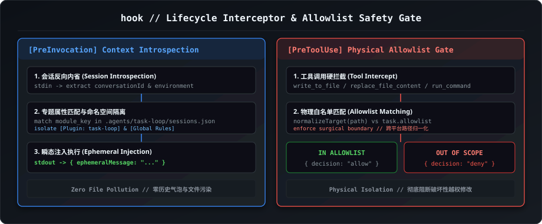

# Hook Topic Skill (`hook`)

本文档为 `task-loop` 中【钩子专题 (`hook`)】的专属技能定义，负责 Google Antigravity 钩子生命周期（`PreInvocation` / `PreToolUse` / `PostToolUse` / `PostInvocation` / `Stop`）、上下文自动感知注入与物理修改白名单越界拦截。



---

## 一、专题核心职责 (Core Responsibilities)

1. **`PreInvocation` 会话上下文感知与注入**:
   - 底层原生拦截模型请求，从系统输入（`stdin`）读取 `conversationId`；
   - 检索 `.agents/task-loop/sessions.json`，获取当前会话的角色定位、所属专题与受控记忆路径；
   - 输出 `{"injectSteps": [{"ephemeralMessage": "..."}]}` 瞬态注入上下文，零 Token 轮询开销且不污染历史。
2. **`PreToolUse` 物理修改白名单硬门禁 (Allowlist Guard)**:
   - 在文件修改工具（`write_to_file`, `replace_file_content`, `multi_replace_file_content`）执行前触发；
   - 严格比对目标文件 `TargetFile` 是否在当前派发任务的 `allowlist` 白名单范围内；
   - 越界修改立即返回 `decision: "deny"` 物理阻断，确保精准实施。
3. **`hooks.json` 插件级配置维护**:
   - 维护插件根目录及 `.agents/hooks.json`，统一支持 Node.js 18+ 与 Python 3.8+ 双运行时处理脚本。

---

## 二、五大支持事件与 I/O 契约规范 (Hooks Lifecycle JSON)

```json
[
  {
    "event": "PreInvocation",
    "trigger_timing": "模型推理发起前",
    "input_fields": "conversationId, workspacePaths, transcriptPath, modelName, invocationNum",
    "output_fields": "injectSteps: [{ephemeralMessage: string} | {userMessage: string}]",
    "primary_use_case": "会话 ID 自动提取与元数据瞬态注入"
  },
  {
    "event": "PreToolUse",
    "trigger_timing": "工具执行前",
    "input_fields": "toolCall (name, args), stepIdx, workspacePaths, conversationId",
    "output_fields": "decision ('allow'|'deny'|'ask'), reason, permissionOverrides",
    "primary_use_case": "Allowlist 物理白名单越界修改阻断与安全防护"
  },
  {
    "event": "PostToolUse",
    "trigger_timing": "工具执行完成后",
    "input_fields": "toolCall, stepIdx, error, conversationId",
    "output_fields": "{}",
    "primary_use_case": "工具失败自省与流水日志记录"
  },
  {
    "event": "PostInvocation",
    "trigger_timing": "模型单次推理完成后",
    "input_fields": "invocationNum, initialNumSteps, conversationId",
    "output_fields": "{}",
    "primary_use_case": "Token 消耗统计与响应分析"
  },
  {
    "event": "Stop",
    "trigger_timing": "会话回合终止时",
    "input_fields": "conversationId, workspacePaths, transcriptPath",
    "output_fields": "{}",
    "primary_use_case": "临时资源垃圾回收与状态落盘"
  }
]
```

---

## 三、实战避坑指南 (Gotchas)

```json
[
  {
    "gotcha_id": "Gotcha 1",
    "title": "ephemeralMessage 瞬态注入",
    "rule": "自动注入背景必须使用 ephemeralMessage，严禁使用 userMessage 伪造用户气泡。"
  },
  {
    "gotcha_id": "Gotcha 2",
    "title": "stdout 纯净输出",
    "rule": "Hook 脚本输出除合法 JSON 外严禁打印额外调试日志，避免破坏宿主 JSON 解析。"
  }
]
```

---

## 三、架构分工原则：调度器主动程序化创建 + Hook 生命周期被动护航

在 `task-loop` 系统架构中，Hook 严格遵循拦截器纯粹性与单一职责原则（SRP）：
1. **被动护航定位**：Hook 属于被动生命周期拦截器，**严禁在 Hook 内部编写拉起新会话或派生进程的逻辑**，以杜绝递归触发与死循环风险；
2. **主动创建收敛于调度器**：所有独立顶层根会话（`nestingDepth: 0`）与子代理会话的物理创建，统一由主调度器 / `init` 脚本通过 `agentapi new-conversation` 主动发起；
3. **协同闭环**：调度器负责“创建物理战场并持久化 sessions.json”，Hook 负责在任意会话被唤醒时“自动发放规则锦囊 (PreInvocation)”并在代码修改时“严守白名单门禁 (PreToolUse)”。

---

## 四、关联受控记忆与参考文档
* **专题受控记忆**: `docs/memory/hook.md`
* **生命周期钩子规范**: `references/hooks-system-deep-spec.md`
* **跨厂商 SDK 契约**: `references/sdk/agy.md`
