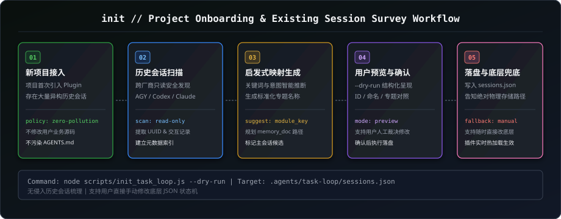

# Project Initialization & Session Survey (`init`)

本项目初始化技能专用于新工程接入 `task-loop` 插件时的状态机建立、已有历史会话调查与专题映射建议。



---

## 一、定位与适用场景 (When to Use)

当新项目安装或引入 `task-loop` 插件时，工程中往往已经存在了大量历史会话（来自 Antigravity、Codex 或 Claude Code），但历史会话的标题、命名规范与领域划分可能各不相同。

`init` 技能负责：
1. **自动扫描历史会话**：无侵入式读取当前工作区的历史会话日志；
2. **启发式生成映射建议**：根据标题、摘要与关键词，自动匹配并推荐专题划分（`module_key`、专题名、标签、受控记忆路径）；
3. **用户交互确认与预览**：以结构化清单呈现给用户，支持用户根据自身意图进行预览与确认；
4. **状态机落盘与兜底修改指引**：写入 `.agents/task-loop/sessions.json`，并明确告知用户文件物理路径，支持随时直接手动修改底层 JSON。

---

## 二、初始化前置注意事项 (Pre-Initialization Considerations)

1. **零污染原则**：初始化仅在 `.agents/task-loop/` 下生成运行态配置文件，严禁修改用户源码或污染项目根目录的 `AGENTS.md`；
2. **只读安全发现**：对历史日志的扫描采用纯只读模式，不修改历史会话内容；
3. **多厂商兼容**：自动兼容 AGY、Codex、Claude Code 会话格式。

---

## 三、标准交互与执行流程 (Standard Workflow)

```text
[启动初始化] -> [扫描历史会话] -> [生成专题映射建议清单] -> [呈现用户确认/预览] -> [状态机落盘] -> [输出兜底修改指引]
```

### 1. 扫描与建议清单生成
执行调查脚本获取建议清单：
* **Node.js (推荐)**: `node scripts/init_task_loop.js --dry-run`
* **Python (备选)**: `python scripts/init_task_loop.py --dry-run`

### 2. 结构化建议呈现示例
向用户输出包含以下字段的建议映射清单：
* **会话 ID (Session ID)**: 会话真实 UUID；
* **原始标题与厂商 (Original Title & Vendor)**: 会话创建时的原标题；
* **建议专题名 (Suggested Topic Name)**: 规范化的专题名称（如“钩子体系与安全拦截专题”）；
* **建议模块 Key (Suggested Module Key)**: 对应的模块标识（如 `hook`）；
* **关联受控记忆 (Memory Doc)**: 规划的记忆路径（如 `docs/memory/hook.md`）；
* **主会话标记 (Main Thread Candidate)**: 是否候选为主治理中枢。

### 3. 用户确认与落盘执行
用户确认或微调后，执行正式写入：
```bash
node scripts/init_task_loop.js
```

---

## 四、底层存储与用户兜底修改机制 (Fallback Editing)

初始化完成后，所有专题与会话映射保存在：
* **核心会话映射表**: `<WorkspaceRoot>/.agents/task-loop/sessions.json`
* **专题声明清单**: `<WorkspaceRoot>/.agents/task-loop/topics.json`
* **任务队列**: `<WorkspaceRoot>/.agents/task-loop/todo.json`
* **调度策略**: `<WorkspaceRoot>/.agents/task-loop/policy.json`

### 用户直接修改指引：
如果用户发现专题划分不合理或希望修改某个会话的绑定关系，**可直接打开 `.agents/task-loop/sessions.json` 手动编辑**：
```json
{
  "schema_version": 2,
  "main_thread_id": "<主会话ID>",
  "modules": {
    "<module_key>": {
      "session_id": "<目标会话ID>",
      "title": "<自定义专题名称>",
      "tags": ["tag1", "tag2"],
      "memory_doc": "docs/memory/<module_key>.md"
    }
  }
}
```
底层 Hook 与调度器会实时读取该文件，改动即刻生效，无需重启任何服务。
