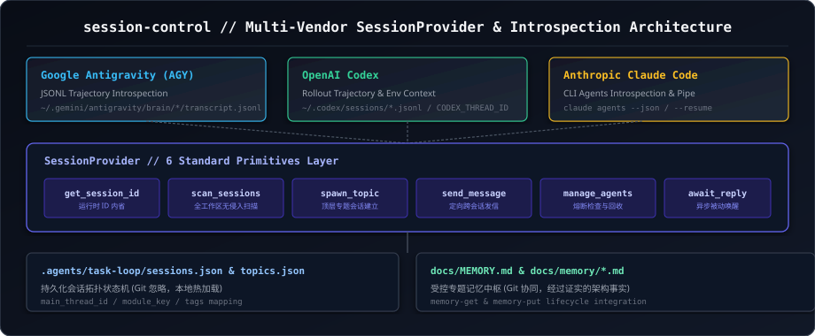

# Session Control Topic Skill (`session-control`)

本文档为 `task-loop` 中【会话控制专题 (`session_control`)】的专属技能定义，负责跨厂商智能体会话抽象、反向内省、生命周期管理与专题路由。



---

## 一、专题核心职责 (Core Responsibilities)

1. **跨厂商会话反向内省 (Reverse Introspection)**:
   - 自动扫描与解析 AGY（`transcript.jsonl`）、Codex（`sessions/*.jsonl` / `CODEX_THREAD_ID`）与 Claude Code（`--resume` / `claude agents`）的历史交互。
2. **六大标准 SessionProvider 原语**:
   - `get_current_session_id`: 获取当前宿主会话 UUID。
   - `scan`: 扫描工程历史会话并提取最近 Prompt 与元数据。
   - `spawn`: 创建独立真实顶层会话（如 `agentapi new-conversation`）。
   - `send`: 定向跨会话发信（如 `send_message` / `agentapi send-message` / `claude -p`）。
   - `manage`: 状态查询、取消或资源回收。
   - `await_reply`: 等待目标会话回复或挂起。
3. **专题拓扑与状态机持久化**:
   - 维护 `.agents/task-loop/sessions.json` 与 `topics.json`，建立模块映射与主会话登记。

---

## 二、六大 SessionProvider 原语规范 (API Primitives JSON)

```json
[
  {
    "primitive": "get_current_session_id",
    "signature": "getCurrentSessionId() -> string | null",
    "description": "读取当前正在执行的会话 UUID（AGY: Hook context / transcript / <user_information>, Codex: CODEX_THREAD_ID, Claude: stdin JSON）。"
  },
  {
    "primitive": "scan",
    "signature": "scanSessions(options) -> SessionInfo[]",
    "description": "按工作区路径扫描历史会话日志，过滤非当前项目碎片。"
  },
  {
    "primitive": "spawn",
    "signature": "spawnSession(spec) -> string (newSessionId)",
    "description": "创建持久化独立顶层专题会话（nestingDepth: 0），返回真实根会话 ID。"
  },
  {
    "primitive": "send",
    "signature": "sendMessage(sessionId, message) -> SendResult",
    "description": "向已存在的持久专题会话定向发信，自动继承历史上下文。"
  },
  {
    "primitive": "manage",
    "signature": "manageSession(action, sessionId) -> ManageResult",
    "description": "会话生命周期治理（list / status / cancel / terminate）。"
  },
  {
    "primitive": "await_reply",
    "signature": "awaitReply(sessionId, timeout) -> ReplyResult",
    "description": "挂机等待专题会话处理完成并获取交付报告（零轮询 Reactive Wakeup）。"
  }
]
```

---

## 三、AGY 严格使用 Sidebus 操作会话实操指引 (AGY Sidebus Guide)

在 Google Antigravity (AGY) 运行时中，主控端与外部编排器统一通过 **Language Server Sidebus**（`agentapi.bat` / `agentapi`）进行物理会话生命周期治理与跨会话调度。

### 1. Sidebus 通信架构与定位 (Sidebus Architecture)

```text
┌─────────────────────────────────────────────────────────────────────────────┐
│                      Language Server Sidebus 通信架构                        │
├─────────────────────────────────────────────────────────────────────────────┤
│ 宿主环境: Antigravity IDE / Language Server                                 │
│ 物理位置: ~/.gemini/antigravity/bin/agentapi.bat (Win) 或 agentapi (POSIX) │
│ 底层调用: language_server.exe agentapi <subcommand>                        │
│ 核心优势: 1. 独立顶层根会话 (nestingDepth: 0)，侧边栏树形展示；             │
│           2. 完整继承工作区配置、Plugins、Skills 与 Hooks 管道；             │
│           3. 支持零轮询 Reactive Wakeup 异步事件驱动。                      │
└─────────────────────────────────────────────────────────────────────────────┘
```

### 2. 环境变量净化与顶层会话保真机制 (Environment Sanitization)

当在主会话子进程、Node.js / Python 脚本或自动化任务中调用 `agentapi` 创建顶层根会话时，**必须对父级环境变量进行严格净化**。若未清除父级会话标记，新会话将被错误识别为嵌套子代理或从属分支，无法在 IDE 顶层侧边栏独立呈现。

```json
[
  {
    "env_variable": "ANTIGRAVITY_CONVERSATION_ID",
    "action": "必须清除 (delete env.ANTIGRAVITY_CONVERSATION_ID)",
    "reason": "防止 Language Server 将新会话误判为当前会话的子分支 (nested child session)。"
  },
  {
    "env_variable": "ANTIGRAVITY_SOURCE_METADATA",
    "action": "必须清除 (delete env.ANTIGRAVITY_SOURCE_METADATA)",
    "reason": "防止继承父级调用元数据，确保生成独立的 rootConversationId。"
  },
  {
    "env_variable": "ANTIGRAVITY_TRAJECTORY_ID",
    "action": "必须清除 (delete env.ANTIGRAVITY_TRAJECTORY_ID)",
    "reason": "防止轨迹 ID 污染，使新会话拥有独立的 Token 审计与上下文轨迹。"
  }
]
```

### 3. 核心调用模板 (Invocation Templates)

#### 3.1 Node.js 创建独立顶层专题会话 (`spawn`)
```javascript
const { spawnSync } = require('child_process');

function createTopLevelTopicSession(title, initialPrompt, workspaceRoot) {
  // 1. 环境变量严格净化
  const env = { ...process.env };
  delete env.ANTIGRAVITY_CONVERSATION_ID;
  delete env.ANTIGRAVITY_SOURCE_METADATA;
  delete env.ANTIGRAVITY_TRAJECTORY_ID;

  // 2. 调用 Sidebus 创建顶层会话
  const cmd = process.platform === 'win32' ? 'agentapi.bat' : 'agentapi';
  const res = spawnSync(cmd, ['new-conversation', `--title=${title}`, initialPrompt], {
    env,
    cwd: workspaceRoot,
    shell: true,
    encoding: 'utf8'
  });

  if (res.stdout) {
    const data = JSON.parse(res.stdout);
    const conversationId = data?.response?.newConversation?.conversationId;
    return conversationId || null;
  }
  return null;
}
```

#### 3.2 Python 创建独立顶层专题会话 (`spawn`)
```python
import os
import subprocess
import json

def create_top_level_topic_session(title: str, initial_prompt: str, workspace_root: str) -> str:
    # 1. 环境变量严格净化
    env = os.environ.copy()
    env.pop("ANTIGRAVITY_CONVERSATION_ID", None)
    env.pop("ANTIGRAVITY_SOURCE_METADATA", None)
    env.pop("ANTIGRAVITY_TRAJECTORY_ID", None)

    # 2. 调用 Sidebus
    cmd = "agentapi.bat" if os.name == "nt" else "agentapi"
    result = subprocess.run(
        [cmd, "new-conversation", f"--title={title}", initial_prompt],
        cwd=workspace_root,
        env=env,
        shell=True,
        capture_output=True,
        text=True,
        encoding="utf-8"
    )
    if result.stdout:
        data = json.loads(result.stdout)
        return data.get("response", {}).get("newConversation", {}).get("conversationId")
    return None
```

#### 3.3 跨会话发信派单 (`send-message`)
```bash
# 跨会话发信命令行格式
agentapi.bat send-message <target_conversation_id> "<message_or_json_payload>"
```

### 4. 真实专题派单实战案例 (Real-World Case: `cdd1ca5c-3532-4489-b844-15c6f34055fa`)

以既有会话控制专题会话 `cdd1ca5c-3532-4489-b844-15c6f34055fa`（`session_control` 专题）为例，主会话或外部调度器通过 Sidebus 下发修改落地任务 (`work`)：

#### 4.1 派单 Payload 结构定义
```json
{
  "task_id": "TASK-20260831-SESSION-CONTROL-001",
  "task_type": "work",
  "topic_key": "session_control",
  "objective": "升级 skills/session-control/SKILL.md 增加 Sidebus 实操指引与案例",
  "allowlist": [
    "skills/session-control/SKILL.md",
    "references/sdk/agy.md",
    "docs/memory/session_control.md"
  ],
  "complexity_tier": 2,
  "acceptance_criteria": [
    "SKILL.md 补充完整 Sidebus 实操指南与环境变量净化代码",
    "包含会话 cdd1ca5c-3532-4489-b844-15c6f34055fa 实操案例",
    "全量单元测试通过 (Exit Code 0)"
  ]
}
```

#### 4.2 具体发信与派单调用命令
```bash
# 执行 agentapi.bat send-message 向会话控制专题会话派发任务
agentapi.bat send-message cdd1ca5c-3532-4489-b844-15c6f34055fa "【任务派发】你是负责【会话控制专题】的专题会话。请按以下白名单执行修改任务：\n- 任务类型: work\n- 物理白名单: skills/session-control/SKILL.md, references/sdk/agy.md, docs/memory/session_control.md\n- 验收准则: 深度优化 SKILL.md 增加 Sidebus 实操指引与案例，完成自测并回写记忆。"
```

#### 4.3 宿主内部原生工具发信调用 (In-Session Native Tool)
若在 Antigravity 宿主主会话内执行派单，直接调用原生 `send_message` 工具：
```json
{
  "tool": "send_message",
  "Recipient": "cdd1ca5c-3532-4489-b844-15c6f34055fa",
  "Message": "【任务派发】你是负责【会话控制专题】的专题会话。请按白名单执行 session-control SKILL 规范升级，完成后向主会话交付汇报。"
}
```

#### 4.4 预期 UI 呈现与响应式唤醒 (UI Presentation & Reactive Wakeup)
1. **IDE 前端渲染**：目标会话（`cdd1ca5c-3532-4489-b844-15c6f34055fa`）收到消息后，在界面顶部呈现 **`Message from Root Agent v`** 折叠卡片，自动加载上下文并开始工作。
2. **零轮询挂机**：主控端发信后直接结束当前轮次，等待系统事件自动唤醒（Reactive Wakeup），目标会话交付完成后自动回传结果。

---

## 四、多厂商能力与实战避坑指南 (Gotchas JSON)

```json
[
  {
    "gotcha_id": "Gotcha 1",
    "title": "Claude Code 环境变量误区",
    "rule": "绝不存在 CLAUDE_SESSION_ID 环境变量，必须通过 Hooks stdin JSON .session_id 注入。"
  },
  {
    "gotcha_id": "Gotcha 2",
    "title": "Claude Code 参数互斥",
    "rule": "--bg（后台代理）与 -p（无头单次执行）严格互斥，不可混用。"
  },
  {
    "gotcha_id": "Gotcha 3",
    "title": "Polling 轮询的 Token 浪费",
    "rule": "在 AGY 中启动子代理或发信后，严禁编写 while(true) 轮询；必须利用系统原生 Reactive Wakeup 机制。"
  },
  {
    "gotcha_id": "Gotcha 7",
    "title": "既有专题派单 vs 临时子代理",
    "rule": "已有长期专题必须优先使用 send_message / agentapi.bat send-message 定向发信，自动继承历史记忆；严禁随意拉起空白瞬态子代理。"
  },
  {
    "gotcha_id": "Gotcha 8",
    "title": "跨会话发信 UI 呈现",
    "rule": "send_message 在 AGY IDE 中以折叠卡形式渲染于目标会话顶部，不伪造人类用户聊天气泡。"
  },
  {
    "gotcha_id": "Gotcha 9",
    "title": "厂商自选择 (Vendor Self-Selection)",
    "rule": "派单或选择会话工具/文档前, 先经 scripts/query_task_loop_state.* 读取目标专题条目的 vendor 与 resumable 字段: resumable=true 按该 vendor 的 SessionProvider send/resume 原语派单; false 为只读遗留, 仅历史内省或经 new-session 重建。厂商与工具映射总表见 references/sdk/README.md。"
  },
  {
    "gotcha_id": "Gotcha 10",
    "title": "主会话派单三步铁律与子代理限制",
    "rule": "1. 寻找专题 -> 2. 没有则 agentapi 新建真实顶层会话 -> 3. sidebus 定向发信。主会话严禁直接修改代码或派遣 Worker 子代理，仅可派遣 reviewer/explorer，所有具体修改必须通过 sidebus 派发至专题会话实施。"
  },
  {
    "gotcha_id": "Gotcha 12",
    "title": "环境变量净化保障顶层根会话",
    "rule": "调用 agentapi new-conversation 时必须清除 ANTIGRAVITY_CONVERSATION_ID、ANTIGRAVITY_SOURCE_METADATA 与 ANTIGRAVITY_TRAJECTORY_ID，确保 nestingDepth: 0。"
  },
  {
    "gotcha_id": "Gotcha 16",
    "title": "看门狗 30s 探针门禁循环与 120s 准入",
    "rule": "inspect_agy_sessions.js --probe-dispatch 提供 thread_running/is_working 细粒度探针。若 is_working === false 绝对严禁挂载 120s 巡检定时器，必须出具告警卡、自愈补发并循环 30s 探针，直到确凿激活才准入 120s 偏差巡检。"
  }
]
```

---

## 五、官方与本地完整文档路径索引 (Reference Registry JSON)

```json
[
  {
    "doc_name": "AGY SDK 手册 (本项目)",
    "relative_path": "references/sdk/agy.md",
    "absolute_path": "d:/jhj/projects/task-loop/references/sdk/agy.md",
    "description": "Google Antigravity 宿主工具原语、Python SDK 与 agentapi CLI 深度规范"
  },
  {
    "doc_name": "跨厂商 SDK 主索引 (本项目)",
    "relative_path": "references/sdk/README.md",
    "absolute_path": "d:/jhj/projects/task-loop/references/sdk/README.md",
    "description": "六大标准会话原语与多厂商能力映射矩阵"
  },
  {
    "doc_name": "新专题会话开辟技能 (本项目)",
    "relative_path": "skills/new-session/SKILL.md",
    "absolute_path": "d:/jhj/projects/task-loop/skills/new-session/SKILL.md",
    "description": "从 docs/memory/*.md 自动发现与开辟独立顶层根会话 (nestingDepth: 0)"
  },
  {
    "doc_name": "专题受控记忆 (本项目)",
    "relative_path": "docs/memory/session_control.md",
    "absolute_path": "d:/jhj/projects/task-loop/docs/memory/session_control.md",
    "description": "会话控制专题已知事实、设计决策与实战陷阱"
  },
  {
    "doc_name": "Antigravity 官方指南与站点地图 (内置)",
    "relative_path": "builtin/skills/antigravity_guide/SKILL.md",
    "absolute_path": "C:/Users/48631/.gemini/antigravity/builtin/skills/antigravity_guide/SKILL.md",
    "description": "Google Antigravity 官方 CLI、IDE、2.0 桌面端与 SDK 综合指南"
  },
  {
    "doc_name": "Antigravity 定制系统指南 (内置)",
    "relative_path": "builtin/skills/agy-customizations/SKILL.md",
    "absolute_path": "C:/Users/48631/.gemini/antigravity/builtin/skills/agy-customizations/SKILL.md",
    "description": "Antigravity Rules、Skills、Plugins、Hooks 与 MCP 官方定制规范"
  }
]
```
