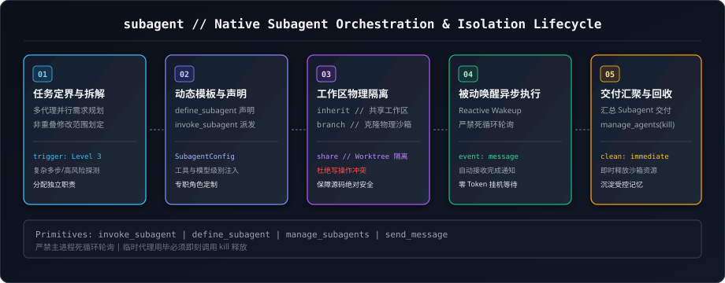

# Subagent Topic Skill (`subagent`)

本文档为 `task-loop` 中【子代理专题 (`subagent`)】的专属技能定义，负责子代理机制编排——AGY 原生原语（invoke/define/manage）与 ZCode 分支的原生 Agent(Task) 工具、生命周期治理与编排规范。



---

## 一、专题核心职责 (Core Responsibilities)

1. **子代理原生工具集封装**:
   - `invoke_subagent`: 动态拉起单一或多个并发子代理，支持 Workspace 隔离模式（`inherit` / `branch` / `share`）与模型分级（`inherit` / `flash_lite` / `flash` / `pro`）。
   - `define_subagent`: 运行时动态定义专属 Worker / Reviewer 模板。
   - `manage_subagents`: 查询活动子代理状态清单（`list`）或定向/全量销毁（`kill` / `kill_all`）。
2. **瞬态临时代理 vs 持久顶层专题会话边界**:
   - **瞬态临时代理 (`invoke_subagent`)**: 依附于当前会话，适合只读探测、沙箱实验与 Level 3 多代理并发；不可跨轮次持久存在。
   - **持久独立根会话 (`agentapi new-conversation`)**: 真实顶层会话，登记于 `.agents/task-loop/sessions.json`，用于长期领域专题维护与跨轮次双向发信。
3. **资源回收与防泄漏**:
   - 任务完成后必须主动调用 `manage_subagents(kill)` 及时回收资源。

---

## 二、子代理原生调用原语规范 (Subagent Tools JSON)

```json
[
  {
    "tool_name": "invoke_subagent",
    "signature": "invoke_subagent(Subagents=[{TypeName, Role, Prompt, Workspace?, Model?}])",
    "description": "并发拉起一个或多个子代理，父代理进入 Reactive Wakeup 挂机状态，子代理汇报时自动唤醒。"
  },
  {
    "tool_name": "define_subagent",
    "signature": "define_subagent(name, description, system_prompt, enable_write_tools?, enable_subagent_tools?, enable_mcp_tools?)",
    "description": "在当前会话生命周期内动态定义全新子代理类型。"
  },
  {
    "tool_name": "manage_subagents",
    "signature": "manage_subagents(Action='list'|'kill'|'kill_all', ConversationIds=[...])",
    "description": "内省子代理运行状态（running, idle, waiting_for_message, errored）与安全销毁。"
  },
  {
    "tool_name": "send_message",
    "signature": "send_message(Recipient, Message)",
    "description": "向已拉起的子代理或独立专题会话下发后续指令或纠偏通知。"
  }
]
```

---

## 三、ZCode 宿主映射 (ZCode Agent Tool Parity)

```json
[
  { "agy_primitive": "invoke_subagent", "zcode_equivalent": "原生 Agent(Task) 工具，同步并发调用、返回即结果；无 Reactive Wakeup" },
  { "agy_primitive": "define_subagent", "zcode_equivalent": "无运行时动态模板; 以 Agents 目录配置或 Skill 内置角色描述替代" },
  { "agy_primitive": "manage_subagents(kill)", "zcode_equivalent": "无需手动回收: 子代理随会话/调用终止自动结束" },
  { "agy_primitive": "send_message(Recipient, Message)", "zcode_equivalent": "同进程 SendMessage; 跨会话以 ReadSessionContext(sess_id) + dispatch 状态包交接" },
  { "zcode_gotcha": "瞬态子代理严禁承载需跨轮次记忆的专题任务——ZCode 无持久根会话拉起 CLI，长期专题须新开会话并经 init 技能登记 sessions.json" }
]
```

---

## 四、实战避坑指南 (Gotchas)

```json
[
  {
    "gotcha_id": "Gotcha 1",
    "title": "无轮询被动唤醒",
    "rule": "拉起子代理后严禁使用 while 循环或 schedule 轮询 manage_subagents；系统在子代理回复时自动触发 Reactive Wakeup。"
  },
  {
    "gotcha_id": "Gotcha 3",
    "title": "工作区隔离写保护",
    "rule": "并行多代理执行写操作时，必须指定 Workspace='branch' 物理隔离，或划定互不重叠的 Allowlist 白名单。"
  },
  {
    "gotcha_id": "Gotcha 8",
    "title": "持久专题 vs 瞬态子代理",
    "rule": "需要跨多轮会话累积记忆的专题必须使用 agentapi new-conversation 创建，严禁误用 invoke_subagent。"
  }
]
```

---

## 五、关联文档与受控记忆 (References)
* **专题受控记忆**: [`docs/memory/subagent.md`](../../docs/memory/subagent.md)
* **AGY SDK 原生规范**: [`references/sdk/agy.md`](../../references/sdk/agy.md)
* **ZCode 分支适配规范**: [`references/sdk/zcode.md`](../../references/sdk/zcode.md)
* **官方规范归档**: [`references/sdk/antigravity-official-docs.md`](../../references/sdk/antigravity-official-docs.md)
