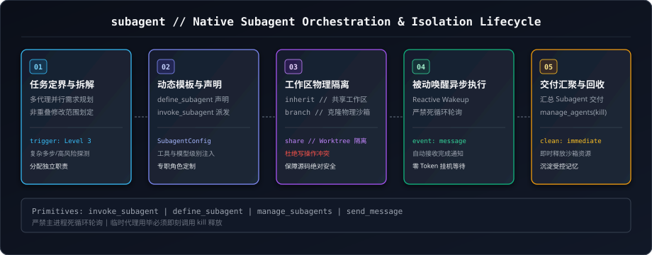

# Subagent Topic Skill (`subagent`)

本文档为 `task-loop` 中【子代理专题 (`subagent`)】的专属技能定义，负责 Google Antigravity 原生子代理机制、动态模板、生命周期治理与 Python SDK 编排。



---

## 一、三层架构定位与专题职责 (Three-Tier Architecture & Core Responsibilities)

本项目确立清晰的三层工作角色分工：
* **L1 最上层 Main 会话（全局中枢）**: 信息收集、统揽全局、决策+编排筹划+批判性门禁验收，严禁直接落地修改业务代码；
* **L2 中层 专题子会话（Topic Session）**: 长期常驻物理实体会话（IDE 侧边栏常驻），负责模块专属落地、深入排障、代码编写与本地自测，最大化大模型 KV Cache 命中率；
* **L3 最底层 子代理（Subagent / Worker）**: 受限在极其具体、上下文少的单一子任务，作为中层专题按需临时拉起的轻量隔离沙箱，用完即毁。

### 核心专题职责:
1. **子代理原生工具集封装**:
   - `invoke_subagent`: 动态拉起单一或多个并发子代理，支持 Workspace 隔离模式（`inherit` / `branch` / `share`）与模型分级（`inherit` / `flash_lite` / `flash` / `pro`）。
   - `define_subagent`: 运行时动态定义专属 Worker / Reviewer 模板。
   - `manage_subagents`: 查询活动子代理状态清单（`list`）或定向/全量销毁（`kill` / `kill_all`）。
2. **瞬态临时代理 vs 持久顶层专题会话边界**:
   - **瞬态临时代理 (`invoke_subagent`)**: 依附于当前会话，适合只读探测、沙箱实验与 Level 3 多代理并发；不可跨轮次持久存在。由专题会话在承接任务后在其内部按需拉起，用完即毁。
   - **主会话派遣限制**: 主会话严禁派遣 Worker (落地/写代码子代理)，主会话只能派遣 `reviewer` (代码走查/审查) 和 `explorer` / `research` (架构只读探索) 子代理；所有业务修改 (WORK) 必须通过 sidebus 派发至专题会话实施。
   - **持久独立根会话 (`agentapi new-conversation`)**: 真实顶层会话，常驻 IDE 侧边栏，登记于 `.agents/task-loop/sessions.json`，用于长期领域专题维护与大模型 KV Cache 复用。
3. **资源回收与防泄漏**:
   - 任务完成后必须主动调用 `manage_subagents(kill)` 及时回收资源。

---

## 二、子代理原生调用原语规范 (Subagent Tools JSON)

```json
[
  {
    "tool_name": "invoke_subagent",
    "signature": "invoke_subagent(Subagents=[{TypeName, Role, Prompt, Workspace?, Model?}])",
    "description": "并发拉起一个或多个子代理，父代理进入 Reactive Wakeup 挂机状态，子代理汇报时自动唤醒。"
  },
  {
    "tool_name": "define_subagent",
    "signature": "define_subagent(name, description, system_prompt, enable_write_tools?, enable_subagent_tools?, enable_mcp_tools?)",
    "description": "在当前会话生命周期内动态定义全新子代理类型。"
  },
  {
    "tool_name": "manage_subagents",
    "signature": "manage_subagents(Action='list'|'kill'|'kill_all', ConversationIds=[...])",
    "description": "内省子代理运行状态（running, idle, waiting_for_message, errored）与安全销毁。"
  },
  {
    "tool_name": "send_message",
    "signature": "send_message(Recipient, Message)",
    "description": "向已拉起的子代理或独立专题会话下发后续指令或纠偏通知。"
  }
]
```

---

## 三、L3 最底层子代理定位、任务边界与选型策略 (L3 Subagent Strategy)

```json
[
  {
    "dimension": "1. 严格派遣门槛 (Dispatch Gate)",
    "rule": "严禁滥用子代理！对于不复杂的单线任务，一律由中层 Topic 专题直接闭环实施；仅在任务繁多 (并发度 >= 2 并行加速) 或存在 Workspace='branch' 物理强隔离沙箱时，才由中层专题按需拉起子代理，彻底杜绝单子代理串行让父会话干等。"
  },
  {
    "dimension": "2. 极窄任务边界 (Narrow Task Boundary)",
    "rule": "子代理仅承担极窄物理白名单 (Allowlist)、上下文依赖少、单一明确的具体子任务。严禁将整个系统庞大历史或长篇背景灌入子代理，保持轻量纯净与极速收敛。"
  },
  {
    "dimension": "3. 高性价比敏捷模型自决 (Cost-Effective Model Selection)",
    "rule": "废除任何硬编码具体模型版本！在模型配置上，强制由 Agent 自主选用高性价比、轻量敏捷、高吞吐的模型 (如 Flash / Lite / Mini 级别)，思考深度精炼，兼顾吞吐速度与成本控制；仅在架构复杂审计与全局交叉校验时才按需选用深度推理模型。"
  }
]
```

---

## 四、实战避坑指南 (Gotchas)

```json
[
  {
    "gotcha_id": "Gotcha 1",
    "title": "无轮询被动唤醒",
    "rule": "拉起子代理后严禁使用 while 循环或 schedule 轮询 manage_subagents；系统在子代理回复时自动触发 Reactive Wakeup。"
  },
  {
    "gotcha_id": "Gotcha 3",
    "title": "工作区隔离写保护",
    "rule": "并行多代理执行写操作时，必须指定 Workspace='branch' 物理隔离，或划定互不重叠的 Allowlist 白名单。"
  },
  {
    "gotcha_id": "Gotcha 8",
    "title": "持久专题 vs 瞬态子代理",
    "rule": "需要跨多轮会话累积记忆的专题必须使用 agentapi new-conversation 创建，严禁误用 invoke_subagent。"
  },
  {
    "gotcha_id": "Gotcha 10",
    "title": "严禁单子代理干等与并发度门槛",
    "rule": "严禁派发单个 subagent 让父会话干等；必须满足并发度 >= 2（多分支并发加速）或存在 Workspace='branch' 物理强隔离沙箱需求时才允许派发子代理，单线任务一律由专题自身直接执行。"
  },
  {
    "gotcha_id": "Gotcha 11",
    "title": "L3 子代理高性价比选型与极窄上下文",
    "rule": "L3 子代理必须选用高性价比敏捷模型 (如 Flash/Lite 等)，严禁塞入冗长非必要历史；严禁为简单单一子任务误用昂贵高延迟大模型。"
  }
]
```

---

## 五、关联文档与受控记忆 (References)
* **专题受控记忆**: [`docs/memory/subagent.md`](../../docs/memory/subagent.md)
* **AGY SDK 原生规范**: [`references/sdk/agy.md`](../../references/sdk/agy.md)
* **官方规范归档**: [`references/sdk/antigravity-official-docs.md`](../../references/sdk/antigravity-official-docs.md)
* **受控记忆主索引**: [`docs/MEMORY.md`](../../docs/MEMORY.md)
* **默认兜底工作流**: [`references/default-fallback-workflow.md`](../../references/default-fallback-workflow.md)
