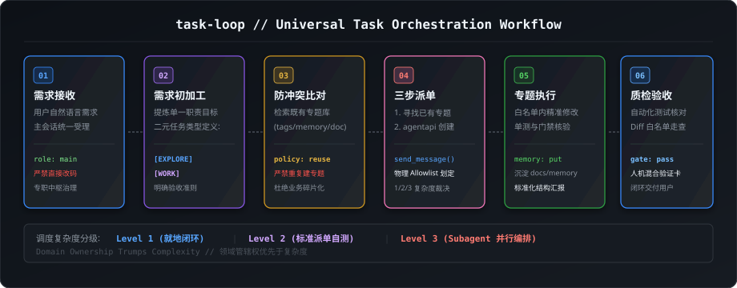

# Universal Task Loop Orchestrator (`task-loop`)

本项目为通用跨智能体任务循环调度中枢，协调主会话与各专题会话之间的任务初加工、分发、质检与闭环。



---

## 一、主会话定位与三步派单铁律 (Main Session 3-Step Law)

### 1. 三步路由流转 (调度器主动创建 + Hook 被动护航)
主会话（Main Session）专注于需求初加工、任务编排、任务类型判定（只读 `explore` vs 修改 `work`）与物理白名单（`allowlist`）划定：
1. **寻找专题会话**: 查阅 `.agents/task-loop/sessions.json`，若存在对应领域的长期专题会话，直接执行步骤 3；
2. **没有则新建 (主动程序化创建)**: 若为全新领域，调度器调用 `agentapi new-conversation --title="[专题名称] 功能1 & 功能2" "<prompt>"`（自动净化父级环境变数，确保 `nestingDepth: 0` 独立顶层根会话）并在 `sessions.json` 持久化登记；
3. **定向发信请求**: 通过 `send_message(recipient, message)` 定向发信下发任务，目标会话激活时由 **`PreInvocation` Hook 自动被动注入该专题专属上下文**，严禁首选本能派发空白临时子代理。

### 2. 专题相似度计算与业务冲突前置裁决 (Topic Similarity & Anti-Conflict Gate)
* **Hook 自动感知与无感创建背景**：在底层 Hook 体系联动下，当主会话请求专题会话时，系统 Hook 会自动判断若目标会话不存在或已归档，将自动无感新建并刷新 `sessions.json`。因此，主会话在请求专题（尤其是判定需要创建全新专题）时，**必须在前置编排阶段对现有所有专题进行语义相似度与业务冲突计算**，避免出现重复专题和大量业务冲突：

```json
[
  {
    "check_stage": "1. 语义与职责范围比对 (Semantic & Scope Matching)",
    "rule": "提取拟下发任务的核心关键词与领域职责，与 .agents/task-loop/sessions.json 中已有专题的 modules、tags、summary 以及 docs/memory/*.md 进行重合度比对。"
  },
  {
    "check_stage": "2. 复用优先裁决 (Reuse First)",
    "rule": "若拟建专题与既有专题语义相似度高或存在重叠业务域（如已有 session_control 则严禁新建 session_manager），强制优先复用并扩展既有专题，禁止碎片化膨胀。"
  },
  {
    "check_stage": "3. 物理边界正交性验证 (Orthogonal Seam Verification)",
    "rule": "仅当拟定专题与既有所有专题具有清晰且不可替代的物理职责边界（如 subagent 独立于 session_control，hook 独立于 subagent）时，才允许发起新建流程。"
  }
]
```

---

## 二、任务类型划分 (Task Type: Explore vs Work)

```json
[
  {
    "task_type": "explore",
    "type_name": "只读探测 / 诊断 / 检索",
    "file_write_permission": false,
    "allowlist_nature": "数据源与检索范围",
    "execution_constraints": "严禁修改任何业务代码与工程配置；只读读取文件与日志；无需执行文件变更 Diff 质检；产物为结构化调研分析报告。"
  },
  {
    "task_type": "work",
    "type_name": "修改落地 / 编码 / 修复",
    "file_write_permission": true,
    "allowlist_nature": "严格物理修改白名单 (Allowlist)",
    "execution_constraints": "仅允许在 Allowlist 白名单内修改，严禁跨模块泛化修改；必须执行本地单测/编译验证 (Exit Code 0)；改动必须经过 Diff 质检与记忆回写。"
  }
]
```

---

## 三、1 / 2 / 3 复杂度做减法规则 (Complexity Tiering)

```json
[
  {
    "complexity": 1,
    "tier_name": "Level 1 (Simple)",
    "scenario": "单点 Bugfix、单文件/文本/配置微调、只读排查、快速查询",
    "dispatch_action": "主会话极速直发单线程就地闭环，无需派单包与外部评审。"
  },
  {
    "complexity": 2,
    "tier_name": "Level 2 (Standard)",
    "scenario": "模块内功能扩展、受控逻辑重构、跨 2~4 个关联文件修改",
    "dispatch_action": "派发至对应专题会话标准开发，执行本地自测与单测门禁。"
  },
  {
    "complexity": 3,
    "tier_name": "Level 3 (Complex)",
    "scenario": "跨模块架构演进、底层重构、预计耗时 > 3 分钟的大型任务",
    "dispatch_action": "强制拉起并行 Subagent（Research / Worker / Reviewer）协同推进与交叉走查。"
  }
]
```

---

## 四、质检门禁与交付标准 (Verification Gate)

子会话交付必须满足 5 步标准流：
`1. 承接锁定 -> 2. 边界实施 -> 3. 本地自测 -> 4. 记忆沉淀 -> 5. 标准交付`。
交付报告必须包含：**Summary (核心摘要)**、**Changes (改动清单)**、**Evidence (单测/构建通过证据)** 以及人机混合验证操作指引。

---

## 五、关联文档与受控记忆 (References)
* **深度派发契约**: [`references/dispatch-contract.md`](../../references/dispatch-contract.md)
* **治理总规范**: [`AGENTS.md`](../../AGENTS.md)
* **受控记忆主索引**: [`docs/MEMORY.md`](../../docs/MEMORY.md)
