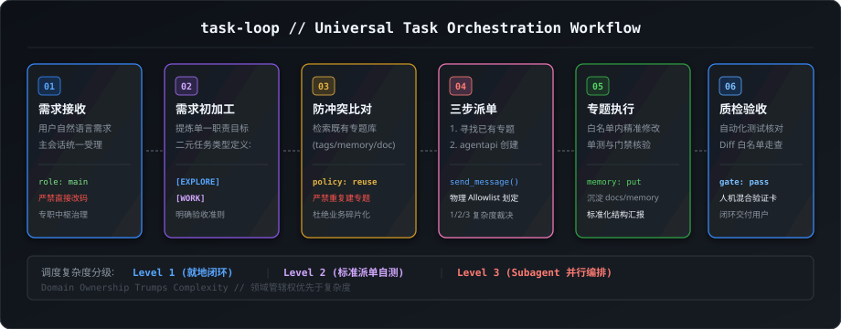

# Universal Task Loop Orchestrator (`task-loop`)

本项目为通用跨智能体任务循环调度中枢，协调主会话与各专题会话之间的任务初加工、分发、质检与闭环。



---

## 一、主会话定位与三步派单铁律 (Main Session 3-Step Law)

### 1. 三步路由流转 (调度器主动创建 + Hook 被动护航)
主会话（Main Session）专注于需求初加工、任务编排、任务类型判定（只读 `explore` vs 修改 `work`）与物理白名单（`allowlist`）划定：
* **主会话行为硬性红线 (Explore Only & Mandatory Sidebus Delegation)**:
  - **仅限只读探索**: 主会话仅承担需求分析、只读探测与架构诊断 (`explore`)，**严禁主会话自身直接执行修改落地 (`work`) 或修改业务代码**；
  - **主会话子代理派遣权限限制**: 主会话严禁派遣 Worker (写代码/落地子代理)，主会话只能派遣 `reviewer` (代码走查/审查) 和 `explorer` / `research` (架构只读探索) 子代理；
  - **强制 sidebus 派单执行**: 所有具体编码与 BugFix (`work`) **必须且强制要求通过 sidebus (`send_message` / `agentapi`) 派发给对应的专题会话 (Topic Session) 实施**；各专题会话承接任务后，方可按需拉起子代理 subagents 落地或直接实施，彻底杜绝主会话直接修改业务代码或擅自拉起临时 Worker；
  - **无可用专题与防擅自派发铁律**: 若没有相关专题会话可用、或不清楚如何新建/请求会话，主会话**必须先检查相关文档指导 (`references/sdk/README.md`, `skills/new-session/SKILL.md`, `skills/session-control/SKILL.md`)**；若仍需确认，**必须主动向用户请求指引并询问**；**绝对禁止主会话自主擅自派遣子代理 Worker 逃避专题治理！**
1. **寻找专题会话**: 查阅 `.agents/task-loop/sessions.json`，若存在对应领域的长期专题会话，直接执行步骤 3；
2. **没有则新建 (主动程序化创建)**: 若为全新领域，调度器调用 `agentapi new-conversation --title="[专题名称] 功能1 & 功能2" "<prompt>"`（自动净化父级环境变数，确保 `nestingDepth: 0` 独立顶层根会话）并在 `sessions.json` 持久化登记；若不知如何创建或无环境，先查阅文档或向用户确认；
3. **Sidebus 定向发信**: 通过 sidebus 管道使用 `send_message(recipient, message)` 定向发信下发任务，目标会话激活时由 **`PreInvocation` Hook 自动被动注入该专题专属上下文**，严禁主会话擅自拉起临时子代理代劳。

### 2. 专题相似度计算与业务冲突前置裁决 (Topic Similarity & Anti-Conflict Gate)
* **Hook 自动感知与无感创建背景**：在底层 Hook 体系联动下，当主会话请求专题会话时，系统 Hook 会自动判断若目标会话不存在或已归档，将自动无感新建并刷新 `sessions.json`。因此，主会话在请求专题（尤其是判定需要创建全新专题）时，**必须在前置编排阶段对现有所有专题进行语义相似度与业务冲突计算**，避免出现重复专题和大量业务冲突：

```json
[
  {
    "check_stage": "1. 语义与职责范围比对 (Semantic & Scope Matching)",
    "rule": "提取拟下发任务的核心关键词与领域职责，与 .agents/task-loop/sessions.json 中已有专题的 modules、tags、summary 以及 docs/memory/*.md 进行重合度比对。"
  },
  {
    "check_stage": "2. 复用优先裁决 (Reuse First)",
    "rule": "若拟建专题与既有专题语义相似度高或存在重叠业务域（如已有 session_control 则严禁新建 session_manager），强制优先复用并扩展既有专题，禁止碎片化膨胀。"
  },
  {
    "check_stage": "3. 物理边界正交性验证 (Orthogonal Seam Verification)",
    "rule": "仅当拟定专题与既有所有专题具有清晰且不可替代的物理职责边界（如 subagent 独立于 session_control，hook 独立于 subagent）时，才允许发起新建流程。"
  }
]
```

### 3. 派单完整背景与信息梳理法定契约 (Full Context Dispatching Protocol)
主会话向专题会话派单时，**严禁省略业务背景只甩修改步骤与白名单清单**！
若仅提供孤立的改动指令（How），会导致专题会话严重缺乏全局视角（Why & Global Context），极易产生信息孤岛、断章取义、破坏隐式业务制约甚至反复走弯路。
因此，主会话派单必须严格遵守【派单完整背景与信息梳理法定契约】，任何派单必须且强制包含以下**四大法定板块**：

```json
[
  {
    "section_id": "Section 1",
    "section_name": "【一、完整业务背景与原始需求 (Background & Full Requirements)】",
    "required_content": "核心痛点、事故反思、原始用户指令全貌还原、业务期望达成形态，解答 Why & Context。"
  },
  {
    "section_id": "Section 2",
    "section_name": "【二、全局信息梳理与技术推演 (Information Breakdown & Rationale)】",
    "required_content": "调用链路梳理、跨模块影响面分析、架构决策与设计权衡、潜在隐式制约与技术风险推演。"
  },
  {
    "section_id": "Section 3",
    "section_name": "【三、实施范围与手术级落地细节 (Objective & Implementation)】",
    "required_content": "精确到文件与函数级别的单一职责目标、具体实施步骤清单、代码改动溯源注释要求。"
  },
  {
    "section_id": "Section 4",
    "section_name": "【四、严格物理白名单与验收门禁 (Allowlist & Verification Gate)】",
    "required_content": "明确任务类型 ([EXPLORE] 或 [WORK])、严格 Allowlist 物理文件白名单、复杂度定级、自测与质检验收准则 (单测/构建/UI刷新)、原有逻辑破坏防御检查与受控记忆回写要求。"
  }
]
```

* **标准派单示范模板 (Standard 4-Section Dispatch Template)**:
```markdown
[主会话派单: WORK] task-xxx: 简明任务标题

【一、完整业务背景与原始需求 (Background & Full Requirements)】
* 核心业务痛点与现状：...
* 原始用户指令与诉求全貌还原：...
* 期望达成的最终架构与功能形态：...

【二、全局信息梳理与技术推演 (Information Breakdown & Rationale)】
* 调用链路与跨模块影响面梳理：...
* 架构设计决策与技术权衡理由：...
* 潜在风险推演与隐式边界制约：...

【三、实施范围与手术级落地细节 (Objective & Implementation)】
1. 模块 A [path/to/fileA]：具体函数修改、新增逻辑与注释溯源...
2. 模块 B [path/to/fileB]：...
3. 联动更新 [path/to/fileC]：...

【四、严格物理白名单与验收门禁 (Allowlist & Verification Gate)】
* 任务类型: WORK (修改落地) / EXPLORE (只读探索)
* 复杂度分级: Level 1 / Level 2 / Level 3
* Allowlist 物理白名单:
  - path/to/fileA
  - path/to/fileB
  - docs/memory/topic.md
* 验收与门禁准则:
  - 严格限制在 Allowlist 范围内，严禁跨模块越界修改；
  - 专题全权负责自身语法检查与功能自测 (提供通过日志/证据)；
  - 严禁擅自删除既有业务校验或破坏状态流转 (门禁1原有逻辑防御)；
  - 任务完成后回写受控记忆 docs/memory/*.md 并通过 send_message 提交 100~800 字精炼交付报告。
```

### 4. 正交多专题异步并行派单与反馈验收队列机制 (Orthogonal Async Dispatch & Verification Queue)

主会话在面对多个跨模块改动时，严禁无视解耦特性机械串行死等，必须按以下标准流转：

```json
[
  {
    "stage": "1. 正交三要素判定 (Orthogonality Check)",
    "rule": "1) 专题隔离 (TargetSession 互异)；2) 白名单正交 (Allowlist 零交集)；3) 逻辑解耦 (无前后依赖)。任一不满足强制降级为串行派发。"
  },
  {
    "stage": "2. 异步并行派发 (Async Dispatch)",
    "rule": "在同一编排周期内向目标专题依次发信 (并发度上限 <= 3)，挂载全局兜底定时器 schedule(TimerCondition='any')，依托 Reactive Wakeup 响应式唤醒。"
  },
  {
    "stage": "3. 反馈验收队列 (FIFO Verification Queue)",
    "rule": "各专题交付推入反馈验收队列，主会话逐个出队独立执行双轮驱动质检与四大绝对门禁审查；单个任务不合规下发 DELIVERABLE_REJECTED 独立驳回，不干扰其他并行任务。"
  }
]
```

---


## 二、三层分级工作角色与模型思考深度自决体系 (Three-Tier Work Roles & Autonomous Model/Reasoning Hierarchy)

为彻底杜绝大模型硬编码版本陈旧脱节问题，本工作流确立【三层分级工作角色，模型选型与思考深度由 Agent 结合任务属性自决】的核心治理机制：

```json
[
  {
    "layer": "L1 (Top Layer)",
    "role": "Main Session (全局中枢 / 治理中枢)",
    "lifecycle_nature": "常驻顶层根会话 (nestingDepth: 0)",
    "core_responsibilities": "用户意图初加工、信息广域收集、架构只读诊断 (EXPLORE)、决策推演、任务编排派单与质检门禁验收。严禁自身编写业务代码 (WORK) 或派遣 Worker 子代理。",
    "model_selection_policy": "选用大上下文、高统筹规划与强决策推理模型；思考深度由 Agent 结合决策复杂度自决 (Autonomous Determination)，杜绝硬编码型号。"
  },
  {
    "layer": "L2 (Middle Layer)",
    "role": "Topic Session (专题物理实体会话 / 领域负责人)",
    "lifecycle_nature": "长期常驻物理实体会话 (Permanent Physical Session)，与 docs/memory/*.md 1:1 强绑定",
    "core_responsibilities": "模块专属落地，负责代码编写、深入排障、语法检查与功能自测。持续积累领域会话历史，最大化大模型 Prompt Token (KV Cache) 命中率。",
    "model_selection_policy": "选用高严密、强逻辑与代码生成能力优异的主力模型；思考深度充沛，由 Agent 结合工程复杂度自决，杜绝硬编码型号。"
  },
  {
    "layer": "L3 (Bottom Layer)",
    "role": "Subagent / Worker (临时子代理 / 任务执行沙箱)",
    "lifecycle_nature": "由 L2 专题会话承接任务后按需拉起，单任务完成即时销毁 (Ephemeral Sandbox)",
    "core_responsibilities": "受限极窄物理白名单、上下文依赖少的单一子任务（如并发检索、隔离验证、辅助生成）。任务繁多或强隔离时按需派遣；简单任务由中层自身直接闭环。",
    "model_selection_policy": "强制选用高性价比、轻量敏捷、高吞吐模型；思考深度精炼，兼顾执行速度与资源效率，由 Agent 结合子任务目标自决，杜绝硬编码型号。"
  }
]
```

---

## 三、任务类型划分 (Task Type: Explore vs Work)

```json
[
  {
    "task_type": "explore",
    "type_name": "只读探测 / 诊断 / 检索",
    "file_write_permission": false,
    "allowlist_nature": "数据源与检索范围",
    "execution_constraints": "严禁修改任何业务代码与工程配置；只读读取文件与日志；无需执行文件变更 Diff 质检；产物为结构化调研分析报告。"
  },
  {
    "task_type": "work",
    "type_name": "修改落地 / 编码 / 修复",
    "file_write_permission": true,
    "allowlist_nature": "严格物理修改白名单 (Allowlist)",
    "execution_constraints": "仅允许在 Allowlist 白名单内修改，严禁跨模块泛化修改；专题全权负责自身语法检查、编译通过与功能有效性自测；交付物必须提供《最小改动自证说明》并经由 Main 会话双轮驱动质检验收与记忆回写。"
  }
]
```

---

## 四、1 / 2 / 3 复杂度做减法规则 (Complexity Tiering)

```json
[
  {
    "complexity": 1,
    "tier_name": "Level 1 (Simple)",
    "scenario": "单点 Bugfix、单文件/文本/配置微调、只读排查、快速查询",
    "dispatch_action": "主会话极速直发单线程就地闭环，无需派单包与外部评审。"
  },
  {
    "complexity": 2,
    "tier_name": "Level 2 (Standard)",
    "scenario": "模块内功能扩展、受控逻辑重构、跨 2~4 个关联文件修改",
    "dispatch_action": "派发至对应专题会话标准开发，执行自主语法检查、功能自测与边界约束。"
  },
  {
    "complexity": 3,
    "tier_name": "Level 3 (Complex)",
    "scenario": "跨模块架构演进、底层重构、预计耗时 > 3 分钟的大型任务",
    "dispatch_action": "派发至专题会话，由专题会话在其内部按需拉起并行 Subagent（Research / Worker / Reviewer）协同推进与交叉走查。"
  }
]
```

---

## 五、双阶梯进度监测与巡检机制 (Dual-Stage Progress Monitor & Inspection Tasks)

为消除专题会话休眠未响应或偏离目标的失控，主会话派单后执行【30s 响应监测器门禁循环 + 120s 巡检任务准入】：

```json
[
  {
    "stage": "Stage 1: 30s 响应监测器循环与自愈门禁",
    "rule": "派单后挂载 schedule(DurationSeconds=30)。触发时运行 node scripts/inspect_agy_sessions.js --monitor-dispatch <id>。若 is_working === false，绝对严禁挂载 120s 巡检任务！立即输出【🔴 专题未激活告警卡】、通过 agentapi 补发唤醒，并继续挂载 30s 进度监测器循环监控直至真实激活。"
  },
  {
    "stage": "Stage 2: 120s 巡检任务准入门禁",
    "rule": "仅当响应监测器确凿返回 is_working === true 后，才准入挂载 schedule(DurationSeconds=120) 进行路径走查与偏差干预。"
  }
]
```

---

## 六、四大绝对门禁与双轮驱动质检体系 (Dual-Engine Verification & Four Gates)

### 1. 破除形式主义单测与编译强假设
* **本质定位**: `task-loop` 是面向任意非 Web 项目、纯脚本、数据/ETL 或嵌入式项目的通用插件。严禁机械强求编写测试类或强行要求自动化单测 Exit Code 0 (GOTCHA-003)；
* **专题会话法定职责**: 专题全权负责自身代码的语法检查、编译通过（若有）与基本功能有效性自测，并在交付时提供《最小改动自证说明》；
* **Main 会话法定核心职责 (双轮驱动质检体系 Dual-Engine Verification)**:
  - **轮 1 (需求清单逐项逆向比对)**: 按照最初需求清单结合改动代码逐项逆向核对，排查遗漏、偷换概念与假交付 (Zero-Diff)；
  - **轮 2 (宏观全面上下文深度质检)**: 发挥 Main 会话宏观全局记忆优势，深入检测历史分支冲突、防功能误改误伤 (Non-Regression)、排查逻辑漏洞与过度修改/多改夹带私货，并严格审查外科手术最小有效更改与代码注释溯源（改动原因清晰可溯源）。

### 2. 四大绝对门禁体系 (The Four Absolute Verification Gates)

专题会话交付必须满足 5 步标准流：
`1. 承接锁定 -> 2. 边界实施 -> 3. 专题自主语法与功能自测 (含代码注释溯源) -> 4. 记忆沉淀 -> 5. 100~800 字精炼交付 (直陈结论、最小自证、代码注释溯源、原有逻辑自查与自测验证)`。

主会话收到交付后，**严禁充当传声筒盲目放行**，必须逐一执行四大绝对门禁审查：

```json
[
  {
    "gate": "门禁 1: 原有逻辑破坏防御 (Non-Regression Defense, 最高优先级)",
    "rule": "逐行逆向审视 Diff，严禁专题擅自删除或弱化任何既有 if 校验、业务门禁、前置条件或提前落盘！发现删除旧逻辑且未获授权的，绝对严禁放行，必须强制触发 DELIVERABLE_REJECTED 驳回重修。"
  },
  {
    "gate": "门禁 2: 外科手术式最小改动自证与代码注释溯源 (Surgical Minimality & Comment Traceability)",
    "rule": "专题交付物必须包含《最小改动自证说明》，逐项映射需求；代码中修改必须具备清晰可溯源的注释说明改动原因；改动超出 Allowlist 白名单或存在无关重构者一律驳回。"
  },
  {
    "gate": "门禁 3: 双轮驱动质检与多维全局风险评估 (Dual-Engine Review & Risk Assessment)",
    "rule": "严禁仅凭表面口头声称放行！主会话必须出具【全局风险漏洞评估卡】，执行需求清单逐项逆向比对，并系统性推演状态机乱序、未就绪提前落盘、边界空值与并发原子性风险。"
  },
  {
    "gate": "门禁 4: Loop 闭环仲裁与主动打回 (Loop Rejection)",
    "rule": "四大门禁未 100% 全过时，主会话必须主动调用 send_message 下发 DELIVERABLE_REJECTED 驳回指令包打回专题重修，直至门禁全过，杜绝让用户充当质检员。"
  }
]
```

### 3. 专题自主自测与验证分流准则 (Verification Triage)
- **通用脚本/数据管道/非Web/通用模块 (`script_or_general`)**：专题自主执行语法检查（如 node/python 语法校验）、基本输入输出自测与核心功能有效性验证，免除强行套写脆弱测试类；
- **已有单测体系的项目 (`unit_test`)**：专题执行既有自动化单测获取物理通过证据；
- **强前端交互与UI渲染 (`ui_reload`)**：免除新建脆弱 mock 单测，执行构建/编译与语法检查，并向用户出具直观明确的【页面刷新验证指引卡】；
- **全栈协作任务 (`hybrid`)**：核心功能自主自测，前端呈现出具交互验证指引。

---

## 七、插件内置生命周期钩子体系 (Plugin Lifecycle Hooks)

本插件内置了轻量跨厂商统一的生命周期 Hook 拦截与上下文注入体系（由 `hook` 专题统一维护开发；**本插件不设独立的 `hook` skill，安装后由宿主环境底层自动加载生效**）：

```json
[
  {
    "hook_name": "PreInvocation",
    "script": "scripts/hooks/inject_session_context.js (.py)",
    "lifecycle_point": "每轮模型推理前 (Pre-Invocation / SessionStart)",
    "core_function": "上下文动态注入与集群态势感知。基于 .agents/task-loop/ 状态机向当前会话注入所属专题职责、治理硬约束、运行状态 (WORKING/IDLE/REVISING) 及当前任务白名单；针对主会话注入全量专题集群态势。"
  },
  {
    "hook_name": "PreToolUse",
    "script": "scripts/hooks/enforce_allowlist.js (.py)",
    "lifecycle_point": "工具执行拦截门禁 (Pre-Tool-Use)",
    "core_function": "物理白名单安全门禁 (Allowlist Guard)。物理拦截专题会话越界写文件行为，防目录前缀碰撞与符号链接逃逸；硬性拦截主会话直接写业务代码，保障派单治理闭环。"
  }
]
```

* **专题与 Skill 解耦机制**: `hook` 专题与实体会话及 `docs/memory/hook.md` 严格 1:1 对齐，但专注于底层生命周期安全与上下文注入钩子的研发与单测维护，不提供面向用户的冗余 Skill；其系统能力直接由本主 Skill 统一概括说明。

---

## 八、关联文档与受控记忆 (References)
* **深度派发与质检契约**: [`references/dispatch-contract.md`](../../references/dispatch-contract.md)
* **治理总规范**: [`AGENTS.md`](../../AGENTS.md)
* **受控记忆主索引**: [`docs/MEMORY.md`](../../docs/MEMORY.md)


